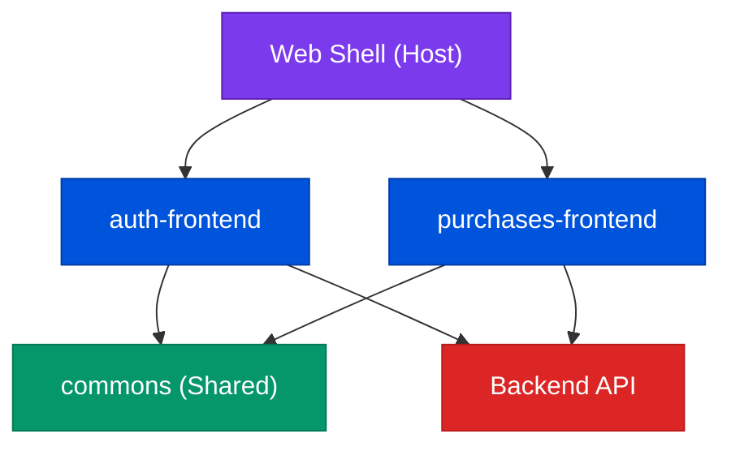
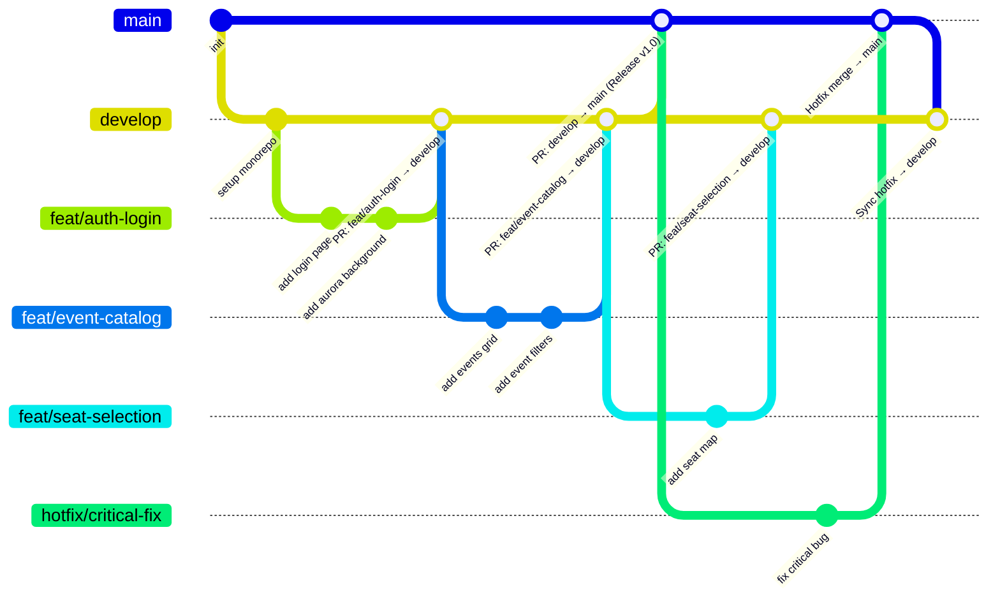
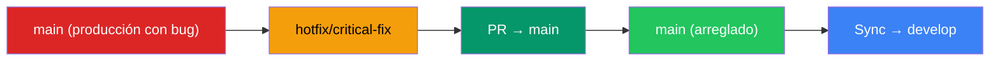
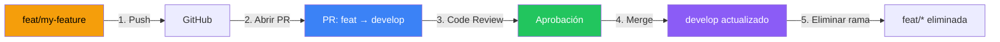
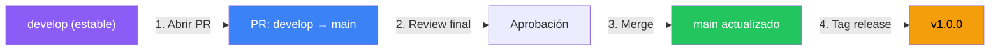
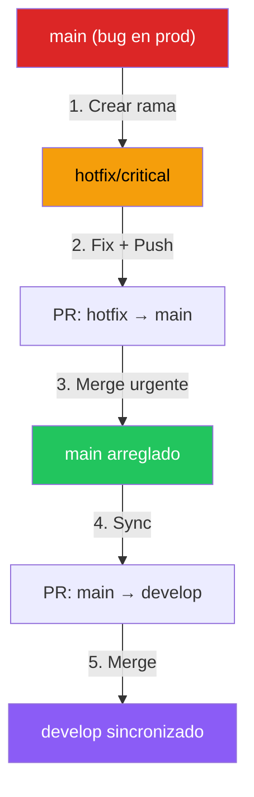
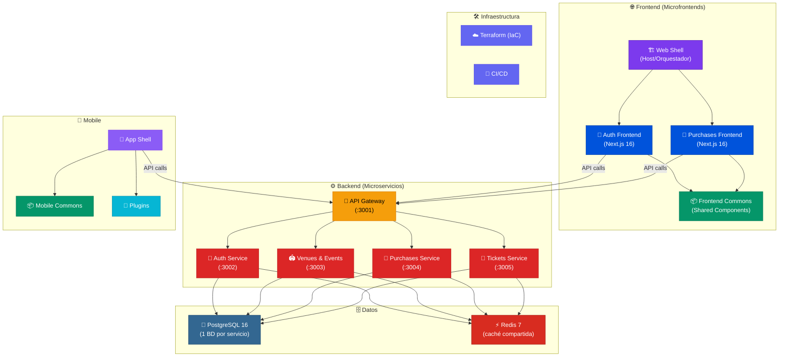

# NextTicket

---

## 1. Stack Tecnológico

### Frontend

| Tecnología | Versión | Uso |
|------------|---------|-----|
| **Next.js** | 16.x | Framework React con SSR/SSG para cada microfrontend |
| **React** | 19.x | Librería UI |
| **Tailwind CSS** | 4.x | Utilidades CSS con design system personalizado (Material 3) |
| **HeroUI** | 3.x | Componentes UI (en auth-frontend) |
| **TypeScript** | 5.x | Tipado estático |

### Backend

| Tecnología | Versión | Uso |
|------------|---------|-----|
| **NestJS** | 11.1.27 | Framework backend para todos los microservicios |
| **Prisma** | 7.8.x | ORM con adapter PostgreSQL (`@prisma/adapter-pg`) |
| **PostgreSQL** | 16 | Base de datos relacional (una por microservicio) |
| **Redis** | 7 | Caché de lectura (patrón cache-aside) |
| **Swagger / Scalar** | 11.4.5 / 1.2.9 | Documentación interactiva de API (OpenAPI 3) |
| **TypeScript** | 5.x | Tipado estático |
| **http-proxy-middleware** | latest | Reverse proxy para el API Gateway |

### Herramientas del Monorepo

| Herramienta | Versión | Propósito |
|-------------|---------|-----------|
| **pnpm** | 11.9 | Gestor de paquetes (workspace-aware, eficiente en disco) |
| **ESLint** | 9.x | Linter adicional por proyecto |

---

## 3. Arquitectura de Microfrontends

NextTicket implementa una arquitectura de **microfrontends Build-time con Workspaces**. Cada microfrontend es una aplicación Next.js independiente dentro del monorepo que se compila y despliega de forma autónoma.

### ¿Qué son los Microfrontends?

Los microfrontends aplican los principios de los microservicios al frontend: **cada equipo o dominio del negocio tiene su propia aplicación frontend**, con su propio código, dependencias, build y deploy.

### Modelo utilizado: Build-time / Workspaces

```
┌──────────────────────────────────────────────────────┐
│                    MONOREPO (pnpm)                    │
│                                                      │
│  ┌────────────────┐  ┌─────────────────────────────┐ │
│  │   web-shell    │  │      auth-frontend           │ │
│  │   (Host/Shell) │  │   (Microfrontend Principal)  │ │
│  │                │  │                               │ │
│  │  Orquesta los  │  │  • Landing Page              │ │
│  │  microfronts   │  │  • Login / Registro          │ │
│  │  Layout global │  │  • Catálogo de Eventos       │ │
│  └────────┬───────┘  │  • Detalle de Evento         │ │
│           │          │  • Selección de Asientos      │ │
│           │          │  • Checkout                   │ │
│           │          │  • Mis Boletos                │ │
│           │          │  • Panel Organizador          │ │
│           │          │  • Validador de Boletos       │ │
│           │          └─────────────────────────────┘ │
│           │                                          │
│  ┌────────┴───────┐  ┌───────────────────┐          │
│  │   purchases-   │  │     commons       │          │
│  │   frontend     │  │  (Librería Comp.) │          │
│  │ (Microfrontend)│  │                   │          │
│  │                │  │  Código compartido│          │
│  │  • Checkout    │  │  entre microfronts│          │
│  │  • Mis Boletos │  └───────────────────┘          │
│  └────────────────┘                                  │
└──────────────────────────────────────────────────────┘
```

### Los 4 Microfrontends

| Microfrontend | Paquete | Puerto | Responsabilidad |
|---------------|---------|--------|-----------------|
| **Web Shell** | `apps/frontend/web-shell` | — | El host/cáscara que orquesta el layout global. Es el punto de entrada de la aplicación |
| **Auth Frontend** | `apps/frontend/auth-frontend` | 3000 | Microfrontend principal: landing, autenticación, eventos, checkout, organizador y validador |
| **Purchases Frontend** | `apps/frontend/purchases-frontend` | 3001 | Microfrontend de compras: checkout y mis boletos (dominio de transacciones) |
| **Frontend Commons** | `apps/frontend/commons` | — | Librería compartida: componentes, tipos y utilidades que usan todos los microfrontends |

### ¿Por qué Build-time y no Runtime (Module Federation)?

| Aspecto | Build-time (Nuestro modelo) | Runtime (Module Federation) |
|---------|---------------------------|---------------------------|
| **Complejidad** | ✅ Más simple — importaciones estáticas | ⚠️ Más complejo — importaciones por HTTP |
| **Performance** | ✅ Un solo bundle optimizado | ⚠️ Carga asíncrona por red |
| **Tipado** | ✅ TypeScript completo en compile-time | ⚠️ Tipos declarados manualmente |
| **Deploy** | ⚠️ Se despliega todo junto | ✅ Deploy independiente por microfront |
| **DX (Developer Experience)** | ✅ HMR funciona sin configuración extra | ⚠️ Necesita preview builds |
| **Ideal para** | ✅ Equipos que comparten repo | ✅ Equipos completamente independientes |

> 💡 **Decisión de diseño:** Elegimos Build-time porque nuestro equipo trabaja en el mismo monorepo, compartimos el design system y las dependencias (React 19, Tailwind 4). La simplicidad de las importaciones estáticas y el tipado completo en compile-time nos dan más productividad.

### Comunicación entre Microfrontends



Cada microfrontend:
- ✅ Tiene su **propio `package.json`**, `next.config.ts`, `tailwind.config.ts`
- ✅ Se **compila de forma independiente** (`next build`)
- ✅ Comparte el **design system** via `commons`
- ✅ Tiene su **propio dominio de negocio** (autenticación, compras, etc.)
- ✅ Puede **desplegarse por separado** en diferentes URLs/puertos

---

## 4. Estructura Completa del Proyecto

```
nextticket/
│
├── 📁 apps/                           # Aplicaciones del monorepo
│   ├── 📁 frontend/                   # ── Microfrontends ──
│   │   ├── 📁 auth-frontend/          # 🔐 MF Principal (Landing + Auth + Eventos + Checkout + Organizer + Validator)
│   │   │   ├── 📁 app/                #    Rutas Next.js (App Router)
│   │   │   │   ├── 📄 layout.tsx      #    Layout raíz (fuentes Geist, Tailwind)
│   │   │   │   ├── 📄 page.tsx        #    Landing page (Hero, BentoGrid, RecentEvents, Newsletter)
│   │   │   │   ├── 📄 globals.css     #    Estilos globales + tokens de diseño
│   │   │   │   ├── 📁 login/          #    Página de login/registro (flip card con aurora background)
│   │   │   │   ├── 📁 eventos/        #    Catálogo de eventos con filtros
│   │   │   │   ├── 📁 event/[id]/     #    Detalle de evento dinámico
│   │   │   │   ├── 📁 seats/          #    Selección interactiva de asientos
│   │   │   │   ├── 📁 checkout/       #    Formulario de compra simulada
│   │   │   │   │   └── 📁 confirmacion/  Confirmación con folio generado
│   │   │   │   ├── 📁 mis-boletos/    #    Dashboard de boletos del usuario
│   │   │   │   ├── 📁 organizer/      #    Panel del organizador
│   │   │   │   │   ├── 📁 dashboard/  #    Dashboard con estadísticas
│   │   │   │   │   ├── 📁 myEvents/   #    CRUD de eventos del organizador
│   │   │   │   │   └── 📁 salesEvent/ #    Ventas por evento
│   │   │   │   ├── 📁 validator/      #    Módulo de validación de boletos
│   │   │   │   │   └── 📁 events/     #    Eventos asignados al validador
│   │   │   │   └── 📁 img/            #    Assets de imágenes
│   │   │   ├── 📁 components/         #    Componentes React
│   │   │   │   ├── 📄 Navbar.tsx      #    Barra de navegación con rutas activas
│   │   │   │   ├── 📄 Footer.tsx      #    Footer con iconos sociales
│   │   │   │   ├── 📄 Stepper.tsx     #    Stepper de 3 pasos (asientos → checkout → confirmación)
│   │   │   │   ├── 📄 icons.tsx       #    Biblioteca de iconos SVG (14 iconos)
│   │   │   │   ├── 📁 landing/        #    Componentes del landing
│   │   │   │   │   ├── 📄 data.ts     #    Datos mock de eventos
│   │   │   │   │   ├── 📄 types.ts    #    Tipos TypeScript del landing
│   │   │   │   │   ├── 📁 sections/   #    Secciones: Hero, BentoGrid, RecentEvents, Newsletter, EventDetail, SeatSelection
│   │   │   │   │   └── 📁 cards/      #    SmallBentoCard
│   │   │   │   ├── 📁 client/         #    Componentes del rol Cliente
│   │   │   │   │   ├── 📁 events/     #    ClientEventsView, ClientEventCard, ClientEventGrid, ClientEventFilters
│   │   │   │   │   ├── 📁 tickets/    #    ClientTicketsView, TicketCard, TicketFilters, TicketQrPreview
│   │   │   │   │   ├── 📁 data/       #    clientMock.ts (datos mock del cliente)
│   │   │   │   │   └── 📁 types/      #    client.ts (tipos del cliente)
│   │   │   │   ├── 📁 organizer/      #    Componentes del rol Organizador
│   │   │   │   │   ├── 📄 OrganizerSidebar.tsx    # Sidebar del panel
│   │   │   │   │   ├── 📄 OrganizerTopbar.tsx     # Topbar del panel
│   │   │   │   │   ├── 📄 OrganizerTable.tsx      # Tabla de eventos
│   │   │   │   │   ├── 📄 ModalEvent.tsx          # Modal crear evento
│   │   │   │   │   ├── 📄 EditModalEvent.tsx      # Modal editar evento
│   │   │   │   │   ├── 📄 ModalDeleteEvent.tsx    # Modal eliminar evento
│   │   │   │   │   └── 📄 ModalProfile.tsx        # Modal perfil del organizador
│   │   │   │   └── 📁 validator/      #    Componentes del rol Validador
│   │   │   │       ├── 📄 ValidatorView.tsx       # Vista principal del validador
│   │   │   │       ├── 📁 events/     #    ValidatorEventsView
│   │   │   │       ├── 📁 layout/     #    Layout del validador
│   │   │   │       ├── 📁 scanner/    #    Escáner QR
│   │   │   │       ├── 📁 results/    #    Resultados de validación
│   │   │   │       ├── 📁 stats/      #    Estadísticas
│   │   │   │       ├── 📁 data/       #    Datos mock del validador
│   │   │   │       └── 📁 types/      #    Tipos del validador
│   │   │   ├── 📄 package.json        #    Dependencias: Next.js 16, React 19, HeroUI, Tailwind 4
│   │   │   ├── 📄 tailwind.config.ts  #    Design system Material 3 (60+ tokens de color)
│   │   │   ├── 📄 next.config.ts      #    Configuración de Next.js
│   │   │   ├── 📄 tsconfig.json       #    TypeScript con paths @/*
│   │   │   ├── 📄 postcss.config.mjs  #    PostCSS con Tailwind
│   │   │   └── 📄 eslint.config.mjs   #    ESLint config
│   │   │
│   │   ├── 📁 purchases-frontend/     # 🛒 MF de Compras (checkout + mis boletos)
│   │   │   ├── 📁 app/
│   │   │   │   ├── 📄 layout.tsx      #    Layout con Inter + JetBrains Mono
│   │   │   │   ├── 📄 page.tsx        #    Redirect a /mis-boletos
│   │   │   │   ├── 📄 globals.css     #    Estilos globales
│   │   │   │   ├── 📁 checkout/       #    Checkout + confirmación
│   │   │   │   └── 📁 mis-boletos/    #    Mis boletos del comprador
│   │   │   ├── 📁 components/
│   │   │   │   ├── 📄 Navbar.tsx
│   │   │   │   ├── 📄 Footer.tsx
│   │   │   │   ├── 📄 Stepper.tsx
│   │   │   │   └── 📄 icons.tsx
│   │   │   ├── 📄 package.json        #    Next.js 16, React 19, Tailwind 4
│   │   │   └── 📄 tailwind.config.ts  #    Mismos tokens de diseño
│   │   │
│   │   ├── 📁 web-shell/              # 🏗️ Shell/Host (orquestador)
│   │   │   └── 📄 index.tsx           #    Punto de entrada del host
│   │   │
│   │   └── 📁 commons/                # 📦 Librería compartida
│   │       └── 📄 index.tsx           #    Exports compartidos entre MFs
│   │
│   ├── 📁 backend/                    # ── Backend Microservicios ──
│   │   ├── 📁 api-gateway/            # 🚪 API Gateway (puerto 3001)
│   │   │   ├── 📁 src/
│   │   │   │   ├── 📄 main.ts         #    Bootstrap: reverse proxy con http-proxy-middleware
│   │   │   │   ├── 📄 app.module.ts   #    Módulo raíz (ConfigModule)
│   │   │   │   └── 📄 app.controller.ts  # GET / (info rutas) + GET /health
│   │   │   ├── 📄 .env                #    URLs de todos los microservicios
│   │   │   └── 📄 package.json        #    NestJS, http-proxy-middleware
│   │   │
│   │   ├── 📁 auth-service/           # 🔑 Servicio de autenticación (puerto 3002)
│   │   │   ├── 📁 src/
│   │   │   │   ├── 📄 main.ts         #    Bootstrap + Swagger/Scalar en /docs/auth
│   │   │   │   ├── 📄 app.module.ts   #    Módulo raíz
│   │   │   │   ├── 📁 users/          #    UsersController, UsersService, DTOs
│   │   │   │   ├── 📁 prisma/         #    PrismaService + PrismaModule (@Global)
│   │   │   │   ├── 📁 redis/          #    RedisService + RedisModule (@Global)
│   │   │   │   └── 📁 health/         #    HealthController (GET /health)
│   │   │   ├── 📁 prisma/             #    schema.prisma + migraciones
│   │   │   ├── 📄 .env                #    DATABASE_URL, REDIS_URL, PORT
│   │   │   ├── 📄 .npmrc              #    public-hoist-pattern para pnpm
│   │   │   └── 📄 package.json        #    NestJS 11.1.27, Prisma, Swagger, Scalar
│   │   │
│   │   ├── 📁 venues-events-service/  # 🏟️ Servicio de recintos y eventos (puerto 3003)
│   │   │   ├── 📁 src/
│   │   │   │   ├── 📄 main.ts         #    Bootstrap + Swagger/Scalar en /docs/venues
│   │   │   │   ├── 📁 venues/         #    VenuesController, VenuesService, DTOs
│   │   │   │   ├── 📁 prisma/         #    PrismaService + PrismaModule
│   │   │   │   ├── 📁 redis/          #    RedisService + RedisModule
│   │   │   │   └── 📁 health/         #    HealthController
│   │   │   ├── 📁 prisma/             #    schema.prisma + migraciones
│   │   │   └── 📄 package.json
│   │   │
│   │   ├── 📁 purchases-service/      # 🛒 Servicio de compras (puerto 3004)
│   │   │   ├── 📁 src/
│   │   │   │   ├── 📄 main.ts         #    Bootstrap + Swagger/Scalar en /docs/purchases
│   │   │   │   ├── 📁 purchases/      #    PurchasesController, PurchasesService, DTOs
│   │   │   │   ├── 📁 prisma/         #    PrismaService + PrismaModule
│   │   │   │   ├── 📁 redis/          #    RedisService + RedisModule
│   │   │   │   └── 📁 health/         #    HealthController
│   │   │   ├── 📁 prisma/             #    schema.prisma + migraciones
│   │   │   └── 📄 package.json
│   │   │
│   │   └── 📁 tickets-service/        # 🎫 Servicio de tickets (puerto 3005)
│   │       ├── 📁 src/
│   │       │   ├── 📄 main.ts         #    Bootstrap + Swagger/Scalar en /docs/tickets
│   │       │   ├── 📁 tickets/        #    TicketsController, TicketsService, DTOs
│   │       │   ├── 📁 prisma/         #    PrismaService + PrismaModule
│   │       │   ├── 📁 redis/          #    RedisService + RedisModule
│   │       │   └── 📁 health/         #    HealthController
│   │       ├── 📁 prisma/             #    schema.prisma + migraciones
│   │       └── 📄 package.json
│   │
│   ├── 📁 mobile/                     # ── Aplicación Móvil ──
│   │   ├── 📁 app-shell/              # Shell de la app móvil
│   │   ├── 📁 commons/                # Código compartido móvil
│   │   └── 📁 plugins/                # Plugins nativos
│   │
│   ├── 📁 addons/                     # Extensiones/plugins
│   └── 📁 e2e/                        # Tests end-to-end globales
│
├── 📁 agents/                         # Agentes de IA/Automatización
├── 📁 docs/                           # Documentación del proyecto
├── 📁 infra/                          # Infraestructura (Terraform)
├── 📁 packages/                       # Paquetes compartidos globales
├── 📁 scripts/                        # Scripts de automatización
├── 📁 stubs/                          # Datos de prueba/mocks
│
├── 📄 package.json                    # Raíz del monorepo (Turbo + Husky)
├── 📄 pnpm-workspace.yaml            # Definición de workspaces pnpm
├── 📄 turbo.json                      # Pipeline de Turborepo (build, dev, lint, test)
├── 📄 tsconfig.base.json             # TypeScript base con path aliases
├── 📄 biome.json                      # Configuración de Biome (linter/formatter)
├── 📄 commitlint.config.cjs          # Validación de commits (Conventional Commits)
├── 📄 .editorconfig                   # Formato consistente entre editores
├── 📄 .gitignore                      # Archivos ignorados por Git
├── 📄 .gitattributes                  # Normalización de EOL
├── 📄 .nvmrc                          # Versión de Node.js (20)
└── 📄 .env.example                    # Variables de entorno de ejemplo
```

---

## 5. Arquitectura de Ramas — Git Flow

Seguimos un flujo de trabajo **Git Flow profesional** para garantizar estabilidad en producción y orden en el desarrollo.

### Diagrama del flujo de ramas



---

### 5.1. Ramas Principales (Permanentes)

Estas ramas **nunca se eliminan**. Son las columnas vertebrales del proyecto.

#### 🟢 `main` — Producción

```
Estado: ✅ Siempre estable y desplegable
```

| Propiedad | Detalle |
|-----------|---------|
| **Contenido** | Código que está en producción |
| **Protección** | 🔒 Rama protegida — **NO se permite push directo** |
| **Recibe cambios de** | Solo desde `develop` vía Pull Request |
| **Quién aprueba** | El Lead o al menos 1 reviewer |

> ⛔ **NUNCA hagas push directo a `main`.** Todo cambio DEBE pasar por revisión vía Pull Request.

#### 🔵 `develop` — Integración

```
Estado: 🔄 Integración continua — última versión en desarrollo
```

| Propiedad | Detalle |
|-----------|---------|
| **Contenido** | Código más reciente con todas las features integradas |
| **Recibe cambios de** | Ramas `feat/*`, `fix/*`, `refactor/*`, `docs/*` vía Pull Request |
| **Promueve a** | `main` cuando está completamente estable |
| **Base para nuevas ramas** | ✅ Todas las ramas de trabajo se crean desde `develop` |

> 💡 **`develop` contiene el código más actualizado.** Crear ramas desde `main` puede causar conflictos severos al integrar.

---

### 5.2. Ramas de Trabajo (Temporales)

Se crean para tareas específicas y **se eliminan después del merge**. Siempre se crean desde `develop` (excepto `hotfix/*`).

#### 🟡 `feat/*` — Nuevas funcionalidades

```bash
# Ejemplo de creación:
git checkout develop
git pull origin develop
git checkout -b feat/seat-selection
```

| Propiedad | Detalle |
|-----------|---------|
| **Origen** | Se crea desde `develop` |
| **Destino** | Se fusiona a `develop` vía PR |
| **Nomenclatura** | `feat/nombre-descriptivo-en-kebab-case` |
| **Ciclo de vida** | Se elimina después del merge |

**Ejemplos reales:**

```
feat/auth-login           → Página de login con flip card
feat/event-catalog        → Catálogo de eventos con filtros
feat/seat-selection       → Mapa interactivo de asientos
feat/checkout-flow        → Flujo de checkout con stepper
feat/organizer-dashboard  → Panel del organizador
feat/validator-scanner    → Escáner QR del validador
feat/purchases-frontend   → Microfrontend de compras
```

#### 🔴 `fix/*` — Corrección de bugs

```bash
git checkout develop
git pull origin develop
git checkout -b fix/navbar-active-state
```

| Propiedad | Detalle |
|-----------|---------|
| **Origen** | Se crea desde `develop` |
| **Destino** | Se fusiona a `develop` vía PR |
| **Nomenclatura** | `fix/descripcion-del-bug` |
| **Cuándo usarla** | Bugs encontrados durante desarrollo (NO en producción) |

**Ejemplos:**

```
fix/navbar-active-state    → Corregir indicador de ruta activa
fix/checkout-total-calc    → Arreglar cálculo del total
fix/stepper-step-display   → Corregir visualización del stepper
fix/event-card-overflow    → Arreglar overflow en tarjetas
```

#### 🟠 `hotfix/*` — Errores críticos en producción

```bash
# ⚠️ CASO EXCEPCIONAL: se crea desde main, NO desde develop
git checkout main
git pull origin main
git checkout -b hotfix/payment-crash
```

| Propiedad | Detalle |
|-----------|---------|
| **Origen** | ⚠️ Se crea desde `main` (excepción) |
| **Destino** | Se fusiona a `main` vía PR, y luego se sincroniza con `develop` |
| **Nomenclatura** | `hotfix/descripcion-critica` |
| **Cuándo usarla** | SOLO errores críticos que afectan producción |
| **Urgencia** | 🔥 Alta — se revisa y fusiona lo antes posible |

> ⚠️ **Los hotfix son casos excepcionales.** Solo se usan para errores críticos que están afectando a usuarios en producción. Después de mergear a `main`, SIEMPRE se debe sincronizar con `develop`.

**Flujo del hotfix:**



#### 🟣 `refactor/*` — Mejoras sin cambiar lógica

```bash
git checkout develop
git pull origin develop
git checkout -b refactor/organizer-components
```

| Propiedad | Detalle |
|-----------|---------|
| **Origen** | Se crea desde `develop` |
| **Destino** | Se fusiona a `develop` vía PR |
| **Nomenclatura** | `refactor/area-de-mejora` |
| **Cuándo usarla** | Reorganizar código, mejorar estructura, sin cambiar comportamiento |

**Ejemplos:**

```
refactor/organizer-components  → Separar componentes del organizador
refactor/clean-services        → Limpiar capa de servicios
refactor/extract-shared-types  → Mover tipos a commons
```

#### 📝 `docs/*` — Documentación

```bash
git checkout develop
git pull origin develop
git checkout -b docs/update-readme
```

| Propiedad | Detalle |
|-----------|---------|
| **Origen** | Se crea desde `develop` |
| **Destino** | Se fusiona a `develop` vía PR |
| **Nomenclatura** | `docs/que-se-documenta` |

**Ejemplos:**

```
docs/update-readme         → Actualizar este README
docs/api-endpoints         → Documentar endpoints del backend
docs/architecture-diagram  → Agregar diagrama de arquitectura
```

---

### 5.3. Resumen visual de ramas

```
main ──────────●───────────────────────●──────────── (solo releases y hotfixes)
               │                       ↑
               │                       │ PR: develop → main
               │                       │
develop ───────●───●───●───●───●───●───●──────────── (integración continua)
               │   ↑   ↑   ↑   ↑   ↑
               │   │   │   │   │   │
feat/login ────┘   │   │   │   │   │
feat/events ───────┘   │   │   │   │
fix/navbar ────────────┘   │   │   │
feat/checkout ─────────────┘   │   │
refactor/types ────────────────┘   │
docs/readme ───────────────────────┘

hotfix/critical ──── (desde main, caso excepcional)
```

---

## 6. Flujo de Trabajo Paso a Paso

Sigue estos pasos **en cada tarea** que te asignen:

### Paso 1: Sincronizar con `develop`

```bash
# Asegúrate de tener la última versión
git checkout develop
git pull origin develop
```

### Paso 2: Crear tu rama de trabajo

```bash
# Para una nueva feature:
git checkout -b feat/nombre-de-la-tarea

# Para un bug fix:
git checkout -b fix/descripcion-del-bug

# Para refactoring:
git checkout -b refactor/area-de-mejora

# Para documentación:
git checkout -b docs/que-se-documenta
```

> 💡 El nombre de la rama debe ser descriptivo y en **kebab-case** (minúsculas separadas por guiones).

### Paso 3: Desarrollar

Realiza tus cambios en los archivos correspondientes del monorepo. Recuerda respetar la arquitectura de microfrontends:

| Si trabajas en... | Modifica archivos en... |
|-------------------|------------------------|
| Login/Registro | `apps/frontend/auth-frontend/app/login/` |
| Landing page | `apps/frontend/auth-frontend/components/landing/` |
| Catálogo de eventos | `apps/frontend/auth-frontend/components/client/events/` |
| Selección de asientos | `apps/frontend/auth-frontend/components/landing/sections/SeatSelection.tsx` |
| Checkout | `apps/frontend/auth-frontend/app/checkout/` |
| Mis boletos | `apps/frontend/auth-frontend/components/client/tickets/` |
| Panel organizador | `apps/frontend/auth-frontend/components/organizer/` |
| Validador | `apps/frontend/auth-frontend/components/validator/` |
| Compras (MF separado) | `apps/frontend/purchases-frontend/` |
| Backend auth | `apps/frontend/auth-backend/src/` |
| Componentes compartidos | `apps/frontend/commons/` |

### Paso 4: Hacer commits

```bash
git add .
git commit -m "[FEAT]: descripción breve y clara"
```

> ⚠️ Los commits deben seguir la [convención de commits](#7-convenciones-de-commits). El hook de Husky validará el formato automáticamente.

### Paso 5: Push de tu rama

```bash
# Primera vez (crea la rama remota):
git push -u origin feat/nombre-de-la-tarea

# Veces posteriores:
git push
```

### Paso 6: Crear Pull Request

Sigue el [proceso de Pull Requests](#8-proceso-de-pull-requests-pr).

---

## 7. Convenciones de Commits

Usamos **Conventional Commits** validados automáticamente con **Husky + Commitlint**. Cada commit debe seguir este formato:

```
[TIPO]: descripción breve y clara
```

### Tipos disponibles

| Tipo | Uso | Ejemplo |
|------|-----|---------|
| `[FEAT]` | Nueva funcionalidad | `[FEAT]: add seat selection interactive map` |
| `[FIX]` | Corrección de errores | `[FIX]: resolve navbar active state on /eventos` |
| `[DOCS]` | Cambios en documentación | `[DOCS]: update README with branch architecture` |
| `[REFACTOR]` | Mejora sin cambiar lógica | `[REFACTOR]: extract shared types to commons` |
| `[STYLE]` | Cambios de formato/estilo | `[STYLE]: fix indentation in checkout page` |
| `[TEST]` | Agregar o modificar tests | `[TEST]: add unit tests for auth service` |
| `[CHORE]` | Tareas de mantenimiento | `[CHORE]: update dependencies to latest` |
| `[PERF]` | Mejoras de rendimiento | `[PERF]: optimize event list rendering` |
| `[CI]` | Cambios en CI/CD | `[CI]: add GitHub Actions workflow` |
| `[BUILD]` | Cambios de build/config | `[BUILD]: update turbo.json pipeline` |

### Reglas de los commits

1. ✅ **Usar imperativo:** "add", "fix", "update" (no "added", "fixing")
2. ✅ **Descripción clara y breve:** máximo 72 caracteres
3. ✅ **Un cambio lógico por commit:** no mezclar features con fixes
4. ✅ **En inglés:** la descripción del commit debe estar en inglés
5. ❌ **No usar:** mensajes vagos como "update", "fix bug", "changes"

### Ejemplos de buenos commits

```bash
git commit -m "[FEAT]: add aurora background animation to login page"
git commit -m "[FEAT]: implement checkout stepper with 3 steps"
git commit -m "[FIX]: correct total calculation in checkout summary"
git commit -m "[REFACTOR]: separate organizer modal into sub-components"
git commit -m "[DOCS]: add microfrontend architecture diagram"
git commit -m "[STYLE]: align footer social icons spacing"
git commit -m "[CHORE]: upgrade React to 19.2.4"
```

### Ejemplos de MALOS commits ❌

```bash
git commit -m "fix"                    # ❌ No dice qué se arregló
git commit -m "update code"            # ❌ Demasiado vago
git commit -m "changes"                # ❌ No informativo
git commit -m "WIP"                    # ❌ No se debe commitear trabajo incompleto
git commit -m "[FEAT]: Agregué login"  # ❌ No usar español ni pasado
```

---

## 8. Proceso de Pull Requests (PR)

> ⛔ **NUNCA se fusiona código localmente entre ramas.** Todo DEBE pasar por GitHub mediante Pull Requests.

### Fase 1: Integración — `feat/*` → `develop`

Este es el flujo más común. Cada feature/fix se integra a `develop` para testing.



**Pasos detallados:**

1. **Abre un Pull Request en GitHub**
   - Ve a tu repositorio en GitHub
   - Click en "Pull Requests" → "New Pull Request"

2. **Configura el PR:**
   - **Base:** `develop` ← (a dónde va el código)
   - **Compare:** `feat/tu-rama` ← (de dónde viene)

3. **Completa la descripción del PR:**
   ```markdown
   ## Descripción
   Breve descripción de los cambios realizados.

   ## Tipo de cambio
   - [ ] Nueva funcionalidad (feat)
   - [ ] Corrección de bug (fix)
   - [ ] Refactoring
   - [ ] Documentación

   ## ¿Cómo probarlo?
   1. Ejecutar `pnpm dev` en auth-frontend
   2. Navegar a /login
   3. Verificar que...

   ## Screenshots (si aplica)
   Capturas de pantalla del cambio visual.
   ```

4. **Espera aprobación** de al menos 1 reviewer

5. **Realiza el merge** (Squash and Merge recomendado)

6. **Elimina la rama** después del merge

---

### Fase 2: Producción — `develop` → `main`

Cuando `develop` está completamente estable y probada, se promueve a `main` (release).



**Pasos:**

1. **Crear PR:**
   - **Base:** `main`
   - **Compare:** `develop`

2. **Verificar que `develop` esté estable:**
   - ✅ Todos los tests pasan
   - ✅ No hay bugs conocidos
   - ✅ Todos los PRs pendientes están mergeados o descartados

3. **Review y aprobación final**

4. **Merge** → producción actualizada

5. **(Opcional) Crear tag de release:**
   ```bash
   git tag -a v1.0.0 -m "Release v1.0.0: MVP con auth, eventos, checkout"
   git push origin v1.0.0
   ```

> ⚠️ **Solo se promueve a `main` cuando `develop` está COMPLETAMENTE estable.** No se permite mergear con bugs conocidos.

---

### Fase especial: Hotfix — `hotfix/*` → `main` → sync `develop`



---

## 9. Prerrequisitos e Instalación

### Requisitos del sistema

```bash
# Verificar versiones:
node -v   # v20 o superior (ver .nvmrc)
pnpm -v   # v11.9 o superior (ver package.json > packageManager)
```

### Instalación

```bash
# 1. Clonar el repositorio
git clone <url-del-repositorio>
cd nextticket

# 2. Instalar dependencias (todas las del monorepo)
pnpm install

# 3. Copiar variables de entorno
cp .env.example .env

# 4. Iniciar en modo desarrollo
pnpm dev
```

### Desarrollo por microfrontend

```bash
# Solo auth-frontend (puerto 3000):
cd apps/frontend/auth-frontend
pnpm dev

# Solo purchases-frontend (puerto 3001):
cd apps/frontend/purchases-frontend
pnpm dev
```

### Desarrollo del backend (microservicios)

Cada microservicio tiene su propia base de datos PostgreSQL y comparte Redis. Antes de levantar los servicios, asegúrate de tener Docker corriendo:

```bash
# 1. Levantar infraestructura (Postgres + Redis)
docker compose up -d
```

Cada microservicio se levanta de forma independiente en su propia terminal:

```bash
# Terminal 1 — API Gateway (puerto 3001)
cd apps/backend/api-gateway
pnpm start:dev

# Terminal 2 — Auth Service (puerto 3002)
cd apps/backend/auth-service
pnpm exec prisma migrate dev --name init   # solo la primera vez
pnpm start:dev

# Terminal 3 — Venues & Events Service (puerto 3003)
cd apps/backend/venues-events-service
pnpm exec prisma migrate dev --name init   # solo la primera vez
pnpm start:dev

# Terminal 4 — Purchases Service (puerto 3004)
cd apps/backend/purchases-service
pnpm exec prisma migrate dev --name init   # solo la primera vez
pnpm start:dev

# Terminal 5 — Tickets Service (puerto 3005)
cd apps/backend/tickets-service
pnpm exec prisma migrate dev --name init   # solo la primera vez
pnpm start:dev
```

> 💡 **Importante:** Usa siempre `pnpm exec prisma ...` en lugar de `npx prisma ...` para evitar conflictos entre gestores de paquetes.

### Mapa de puertos del backend

| Servicio | Puerto | Base de datos | Documentación (Scalar) |
|----------|--------|---------------|------------------------|
| **API Gateway** | `3001` | — (sin datos propios) | — |
| **Auth Service** | `3002` | `auth_db` | `http://localhost:3001/docs/auth` |
| **Venues & Events** | `3003` | `venues_events_db` | `http://localhost:3001/docs/venues` |
| **Purchases Service** | `3004` | `purchases_db` | `http://localhost:3001/docs/purchases` |
| **Tickets Service** | `3005` | `tickets_db` | `http://localhost:3001/docs/tickets` |

### Rutas del API Gateway

Todo el tráfico de los clientes (frontend/mobile) pasa por el Gateway en `http://localhost:3001`:

| Ruta | Destino |
|------|---------|
| `GET /` | Info del gateway y rutas disponibles |
| `GET /health` | Estado del gateway |
| `/users/**` | → auth-service |
| `/venues/**` | → venues-events-service |
| `/purchases/**` | → purchases-service |
| `/tickets/**` | → tickets-service |
| `/docs/{servicio}` | Documentación Scalar del servicio |
| `/api-json/{servicio}` | OpenAPI JSON del servicio |

---

## 10. Comandos Disponibles

### Comandos raíz (ejecutar desde la raíz del proyecto)

| Comando | Descripción |
|---------|-------------|
| `pnpm install` | Instala todas las dependencias del monorepo |
| `pnpm dev` | Inicia TODOS los servicios en modo desarrollo (via Turbo) |
| `pnpm build` | Compila TODOS los proyectos (via Turbo con caché) |
| `pnpm lint` | Ejecuta linters en TODOS los proyectos |
| `pnpm test` | Ejecuta tests en TODOS los proyectos |

### Comandos por workspace

```bash
# Ejecutar un comando en un workspace específico:
pnpm --filter auth-frontend dev           # Dev solo del auth-frontend
pnpm --filter purchases-frontend build    # Build solo del purchases-frontend
pnpm --filter auth-service start:dev      # Dev solo del auth-service
```

### Pipeline de Turbo

Definido en `turbo.json`:

```json
{
  "pipeline": {
    "build": {
      "dependsOn": ["^build"],     // Compila dependencias primero
      "outputs": ["dist/**", ".next/**"]
    },
    "dev": { "cache": false },     // Dev no cachea
    "lint": { "outputs": [] },
    "test": { "outputs": ["coverage/**"] }
  }
}
```

---

## 11. Roles y Módulos de la Aplicación

NextTicket maneja 4 roles de usuario, cada uno con su propio módulo:

### 👤 Cliente

| Funcionalidad | Ruta | Archivo principal |
|---------------|------|-------------------|
| Landing page | `/` | `app/page.tsx` |
| Catálogo de eventos | `/eventos` | `components/client/events/ClientEventsView.tsx` |
| Detalle de evento | `/event/[id]` | `components/landing/sections/EventDetail.tsx` |
| Selección de asientos | `/seats` | `components/landing/sections/SeatSelection.tsx` |
| Checkout | `/checkout` | `app/checkout/page.tsx` |
| Confirmación | `/checkout/confirmacion` | `app/checkout/confirmacion/page.tsx` |
| Mis boletos | `/mis-boletos` | `components/client/tickets/ClientTicketsView.tsx` |

### 🎭 Organizador

| Funcionalidad | Ruta | Archivo principal |
|---------------|------|-------------------|
| Dashboard | `/organizer/dashboard` | `app/organizer/dashboard/page.tsx` |
| Mis eventos | `/organizer/myEvents` | `app/organizer/myEvents/page.tsx` |
| Ventas por evento | `/organizer/salesEvent` | `app/organizer/salesEvent/page.tsx` |

### ✅ Validador

| Funcionalidad | Ruta | Archivo principal |
|---------------|------|-------------------|
| Vista principal | `/validator` | `components/validator/ValidatorView.tsx` |
| Eventos asignados | `/validator/events` | `components/validator/events/ValidatorEventsView.tsx` |

### 🔐 Autenticación

| Funcionalidad | Ruta | Archivo principal |
|---------------|------|-------------------|
| Login/Registro | `/login` | `app/login/page.tsx` |

---

## 12. Reglas del Equipo

### ⛔ Prohibido

| Regla | Consecuencia |
|-------|--------------|
| Push directo a `main` | El branch está protegido; el push será rechazado |
| Push directo a `develop` | Todo debe pasar por PR |
| Merge local entre ramas | Siempre usar GitHub PRs |
| Commits sin convención | Husky rechazará el commit |
| Crear ramas desde `main` | Excepto hotfixes — siempre desde `develop` |
| Dejar ramas sin eliminar post-merge | Mantener el repo limpio |

### ✅ Obligatorio

| Regla | Razón |
|-------|-------|
| Crear PRs con descripción completa | Para que el reviewer entienda el cambio |
| Esperar aprobación antes de mergear | Garantizar calidad del código |
| Sincronizar con `develop` antes de crear rama | Evitar conflictos |
| Usar la convención de commits | Historial limpio y legible |
| Respetar la estructura de microfrontends | Cada dominio en su carpeta |
| Ejecutar `pnpm lint` antes del PR | Código limpio y consistente |

---

## 13. Diagrama de Arquitectura General



---

<p align="center">
  <strong>Hecho con 💜 por el equipo NextTicket</strong>
</p>

<p align="center">
  <em>Monorepo · Microfrontends · Git Flow · Arquitectura SOFEA</em>
</p>