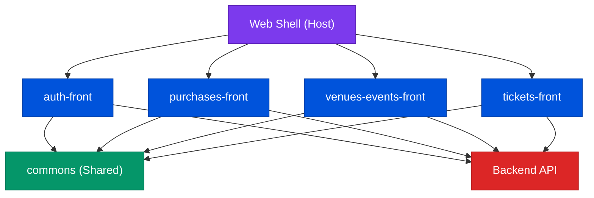
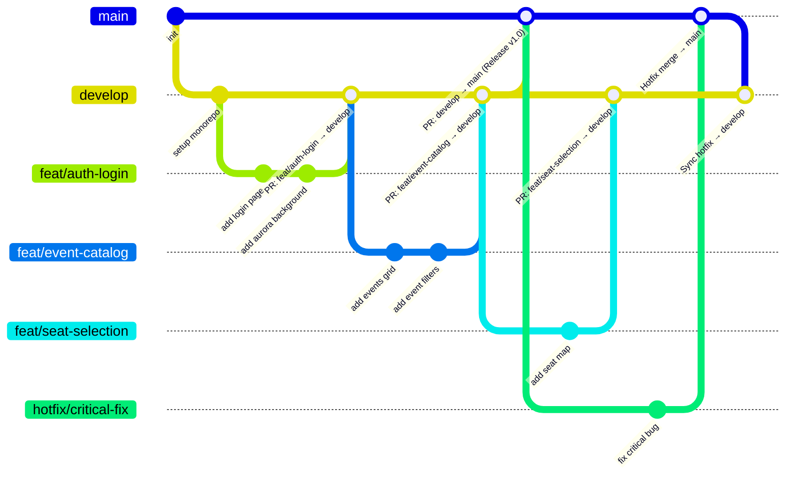
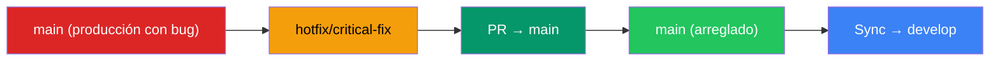
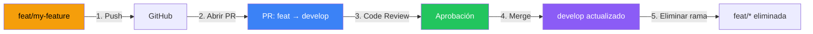
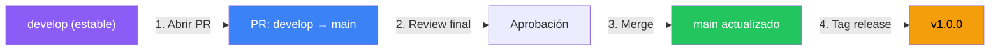
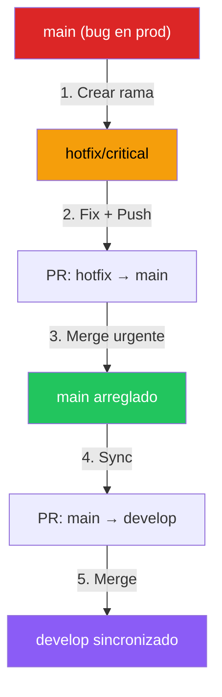
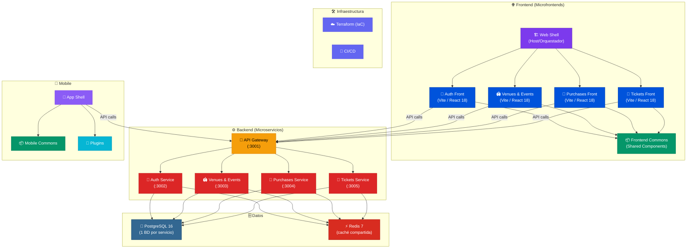

# NextTicket

## 1. Stack Tecnológico

### Frontend

| Tecnología | Versión | Uso |
|------------|---------|-----|
| **Vite** | 5.x | Bundler rápido y entorno de desarrollo para cada microfrontend |
| **React** | 18.x | Librería UI |
| **TypeScript** | 5.x | Tipado estático |
| **Tailwind CSS** | 4.x | Utilidades CSS con design system personalizado (Material 3) |
| **HeroUI** | 3.x | Componentes UI |

### Backend

| Tecnología | Versión | Uso |
|------------|---------|-----|
| **NestJS** | 11.1.27 | Framework backend para todos los microservicios |
| **Prisma** | 7.8.x | ORM con adapter PostgreSQL (`@prisma/adapter-pg`) |
| **PostgreSQL** | 16 | Base de datos relacional (una por microservicio) |
| **Redis** | 7 | Caché de lectura (patrón cache-aside) |
| **Swagger / Scalar** | 11.4.5 / 1.2.9 | Documentación interactiva de API (OpenAPI 3) |
| **TypeScript** | 5.x | Tipado estático |
| **http-proxy-middleware** | latest | Reverse proxy para el API Gateway |

### Herramientas del Monorepo

| Herramienta | Versión | Propósito |
|-------------|---------|-----------|
| **NPM Workspaces** | latest | Gestión de dependencias global para los microfrontends (`apps/frontend`) |
| **pnpm** | 11.x | Gestor de paquetes individual para cada microservicio del backend |

---

## 2. Arquitectura de Microfrontends

Cada microfrontend es una aplicación React (Vite) independiente dentro del monorepo que se compila y despliega de forma autónoma.

### Modelo utilizado: Build-time / Workspaces

```
┌──────────────────────────────────────────────────────┐
│                  NPM WORKSPACES                      │
│                                                      │
│  ┌────────────────┐  ┌─────────────────────────────┐ │
│  │   webshell     │  │      auth-front             │ │
│  │   (Host/Shell) │  │  • Login / Registro          │ │
│  │                │  │  • Perfil                    │ │
│  │  Orquesta los  │  └─────────────┬───────────────┘ │
│  │  microfronts   │                │                 │
│  │  Layout global │  ┌─────────────▼───────────────┐ │
│  └────────┬───────┘  │  venues-events-front        │ │
│           │          │  • Landing / Catálogo        │ │
│           │          │  • Detalle Evento            │ │
│           │          │  • Panel Organizador         │ │
│           │          └─────────────┬───────────────┘ │
│           │                        │                 │
│           │          ┌─────────────▼───────────────┐ │
│           ├─────────►│     purchases-front         │ │
│           │          │  • Checkout                  │ │
│           │          │  • Historial                 │ │
│           │          └─────────────┬───────────────┘ │
│           │                        │                 │
│           │          ┌─────────────▼───────────────┐ │
│           ├─────────►│      tickets-front          │ │
│           │          │  • Selección Asientos        │ │
│           │          │  • Mis Boletos               │ │
│           │          │  • Validador QR              │ │
│           │          └─────────────────────────────┘ │
│           │                                          │
│           ▼          ┌───────────────────┐          │
│                      │     commons       │          │
│                      │  (Librería Comp.) │          │
│                      └───────────────────┘          │
└──────────────────────────────────────────────────────┘
```

### Los 6 Microfrontends

| Microfrontend | Paquete | Puerto | Responsabilidad |
|---------------|---------|--------|-----------------|
| **Web Shell** | `apps/frontend/apps/webshell` | 4000 | El host/cáscara que orquesta el layout global. Es el punto de entrada de la aplicación |
| **Auth Frontend** | `apps/frontend/apps/auth-front` | Microfrontend de autenticación: login, registro y perfil |
| **Venues & Events Frontend** | `apps/frontend/apps/venues-events-front` | Microfrontend de eventos: landing, catálogo, detalle de evento y panel organizador |
| **Purchases Frontend** | `apps/frontend/apps/purchases-front` | Microfrontend de compras: flujo de checkout y pasarela de pago |
| **Tickets Frontend** | `apps/frontend/apps/tickets-front` | Microfrontend de boletos: mapa de asientos, mis boletos y app de validador |
| **Frontend Commons** | `apps/frontend/commons` | Librería compartida: componentes, tipos y utilidades que usan todos los microfrontends |

### Comunicación entre Microfrontends



Cada microfrontend:
- ✅ Tiene su **propio `package.json`**, `vite.config.ts`, `tailwind.config.ts`
- ✅ Se **compila de forma independiente** (`vite build`)
- ✅ Comparte el **design system** via `commons`
- ✅ Tiene su **propio dominio de negocio** (autenticación, compras, etc.)
- ✅ Puede **desplegarse por separado** en diferentes URLs/puertos

---

## 3. Estructura Completa del Proyecto

```
nextticket/
│
├── 📁 apps/                           # Aplicaciones del monorepo
│   ├── 📁 frontend/                   # ── Entorno de Microfrontends (NPM) ──
│   │   ├── 📄 package.json            #    NPM Workspaces ("workspaces": ["commons", "apps/*"])
│   │   ├── 📁 commons/                # 📦 Librería compartida (UI, Store)
│   │   │   └── 📄 package.json        #    @nextticket-frontend/commons
│   │   └── 📁 apps/                   # ── Microfrontends ──
│   │       ├── 📁 auth-front/         # 🔐 MF de Autenticación
│   │       │   ├── 📁 src/            #    Código fuente (Vite + React)
│   │       │   └── 📄 package.json    #    @nextticket-frontend/auth-front
│   │       │
│   │       ├── 📁 venues-events-front/ # 🏟️ MF de Eventos y Recintos
│   │       │   ├── 📁 src/            #    Código fuente
│   │       │   └── 📄 package.json    #    @nextticket-frontend/venues-events
│   │       │
│   │       ├── 📁 purchases-front/    # 🛒 MF de Compras
│   │       │   ├── 📁 src/            #    Código fuente
│   │       │   └── 📄 package.json    #    @nextticket-frontend/purchases
│   │       │
│   │       ├── 📁 tickets-front/      # 🎫 MF de Boletos
│   │       │   ├── 📁 src/            #    Código fuente
│   │       │   └── 📄 package.json    #    @nextticket-frontend/tickets
│   │       │
│   │       └── 📁 webshell/           # 🏗️ Shell/Host (Orquestador principal)
│   │           ├── 📁 src/            #    Configuración de integración
│   │           └── 📄 package.json    #    @nextticket-frontend/webshell
│   │
│   └── 📁 backend/                    # ── Microservicios Backend (PNPM aislado) ──
│       ├── 📁 api-gateway/            # 🚪 API Gateway (puerto 3001)
│       │   ├── 📁 src/
│       │   │   ├── 📄 main.ts         #    Bootstrap: reverse proxy
│       │   │   └── 📄 app.module.ts   #    Módulo raíz
│       │   ├── 📄 .env                #    URLs de los microservicios
│       │   └── 📄 package.json        #    NestJS
│       │
│       ├── 📁 auth-service/           # 🔑 Servicio de autenticación (puerto 3002)
│       │   ├── 📁 src/
│       │   │   ├── 📁 users/          #    UsersController, UsersService
│       │   │   ├── 📁 prisma/         #    PrismaService
│       │   │   └── 📁 redis/          #    RedisService
│       │   ├── 📁 prisma/             #    schema.prisma
│       │   └── 📄 package.json        #    NestJS, Prisma
│       │
│       ├── 📁 venues-events-service/  # 🏟️ Servicio de recintos y eventos (puerto 3003)
│       │   ├── 📁 src/
│       │   ├── 📁 prisma/
│       │   └── 📄 package.json
│       │
│       ├── 📁 purchases-service/      # 🛒 Servicio de compras (puerto 3004)
│       │   ├── 📁 src/
│       │   ├── 📁 prisma/
│       │   └── 📄 package.json
│       │
│       └── 📁 tickets-service/        # 🎫 Servicio de tickets (puerto 3005)
│           ├── 📁 src/
│           ├── 📁 prisma/
│           └── 📄 package.json
│
├── 📁 docs/                           # Documentación general
└── 📄 nextticket.sql                  # Respaldo / Base de datos inicial
```

---

## 4. Convenciones de Desarrollo y Código

Para garantizar consistencia, escalabilidad y facilidad de mantenimiento, todo el equipo debe adherirse a las siguientes reglas estrictas de codificación.

### 🌐 Reglas Generales y de Idioma

1. **Código en Inglés, Documentación en Español:** 
   - Todo el código fuente (nombres de variables, funciones, clases, interfaces, archivos y comentarios dentro del código) **DEBE estar en inglés**. Ejemplo: `UsersController`, `findAll()`, `CreateUserDto`.
   - La documentación a nivel de repositorio (este `README.md`, descripciones de Pull Requests) se mantiene en **español**.
   - **Nunca mezclar:** No usar "Spanglish" en el código (ej. `obtenerUsers()` ❌ → `getUsers()` ✅).
2. **Single Responsibility Principle (SRP):** Cada archivo, componente o clase debe hacer **una sola cosa**.
3. **Nombres Descriptivos:** Prefiere variables y funciones con nombres claros y largos antes que escribir comentarios explicando código confuso.

### ⚙️ Convenciones de Backend (NestJS)

1. **Estructura Estándar:** Cada módulo debe contener su propio `controller`, `service`, y `module`. Las validaciones de entrada van siempre en una subcarpeta `dto/`.
2. **Nomenclatura de Archivos:** Todo archivo debe estar en `kebab-case` seguido de su tipo. Ejemplos: `users.controller.ts`, `create-user.dto.ts`, `app.module.ts`.
3. **Nomenclatura de Clases:** Toda clase debe estar en `PascalCase`. Ejemplos: `UsersController`, `UsersService`.
4. **Documentación de API:** Es **obligatorio** el uso de los decoradores de `@nestjs/swagger` en cada controlador y endpoint:
   - `@ApiTags('recurso')` en el controlador.
   - `@ApiOperation({ summary: '...' })` en cada método.
   - `@ApiParam` o `@ApiQuery` cuando sea necesario.
5. **Acceso a Datos:** Toda interacción con la base de datos se realiza **única y exclusivamente** mediante `PrismaService` inyectado en la capa de `Service` (nunca en el Controller).
6. **Caché:** Usar `RedisService` inyectado para aplicar el patrón *cache-aside* en lecturas frecuentes.
7. **Paginación:** Todo endpoint que devuelve una colección **debe estar paginado** siguiendo el contrato de la sección [Paginación de listados](#paginación-de-listados).

### 📄 Paginación de listados

Cada microservicio tiene su propia copia de los mismos tres archivos (los servicios son paquetes independientes, igual que `prisma/` y `redis/`):

| Archivo | Responsabilidad |
|---------|-----------------|
| `src/common/dto/pagination-query.dto.ts` | `PaginationQueryDto`: valida `page` y `limit` |
| `src/common/dto/paginated-response.dto.ts` | `PaginatedResponseDto<T>` y `PaginationMetaDto`: forma de la respuesta |
| `src/common/pagination.helper.ts` | `toPrismaPagination`, `buildPaginatedResponse`, `isCacheablePage` |

**Query params** (ambos opcionales):

| Param | Default | Reglas |
|-------|---------|--------|
| `page` | `1` | entero ≥ 1 |
| `limit` | `20` | entero entre 1 y 100 |

Un valor inválido responde `400` con el mensaje de `class-validator` (ej. `limit must not be greater than 100`).

**Forma de la respuesta** — todos los listados devuelven este envoltorio, nunca un arreglo suelto:

```json
{
  "data": [ /* registros de la página */ ],
  "meta": {
    "total": 137,
    "page": 1,
    "limit": 20,
    "totalPages": 7,
    "hasNextPage": true,
    "hasPreviousPage": false
  }
}
```

**Cómo se usa en un módulo nuevo:**

```ts
// controller
@Get()
@ApiOperation({ summary: 'Listar recursos (paginado)' })
findAll(@Query() pagination: PaginationQueryDto) {
  return this.resources.findAll(pagination);
}

// service
async findAll(pagination: PaginationQueryDto) {
  const { skip, take } = toPrismaPagination(pagination);

  const [rows, total] = await this.prisma.$transaction([
    this.prisma.resource.findMany({ skip, take, where, orderBy: { createdAt: 'desc' } }),
    this.prisma.resource.count({ where }),
  ]);

  return buildPaginatedResponse(rows, total, pagination);
}
```

Reglas al implementarlo:

1. **Siempre un `orderBy` estable**, si no las páginas se traslapan o pierden registros.
2. **El `count` usa el mismo `where` que el `findMany`**, para que `total` respete los filtros aplicados.
3. **Caché:** la llave de lista guarda una sola entrada, así que solo se cachea la página por defecto (`isCacheablePage`). Las demás páginas y las consultas filtradas van directo a PostgreSQL; así las invalidaciones que ya existen (`redis.del`) siguen siendo correctas.

**Endpoints paginados actualmente:**

| Servicio | Endpoint |
|----------|----------|
| auth | `GET /users` |
| venues-events | `GET /venues` |
| venues-events | `GET /events` (respeta `organizerId`, `status`, `categoryId`, `category`) |
| venues-events | `GET /event-categories` |
| venues-events | `GET /events/:eventId/seats` (respeta `eventZoneId`, `sectionId`, `status`) |
| purchases | `GET /purchases` |
| tickets | `GET /tickets` |

### 🎨 Convenciones de Frontend (Vite + React)

1. **Nomenclatura de Archivos y Componentes:**
   - Componentes de React: `PascalCase.tsx` (ej. `AuthModule.tsx`, `ClientEventsView.tsx`).
   - Archivos de entrada/configuración: `minúsculas` (ej. `main.tsx`, `index.ts`, `vite.config.ts`).
2. **Estructura de Microfrontends:**
   - La convención de nombres para cada paquete de microfrontend es `[service]-front` (ej. `auth-front`, `tickets-front`).
   - Cada microfrontend debe exportar un módulo raíz (ej. `AuthModule`) desde su `src/index.ts` para que el `webshell` pueda importarlo limpiamente sin la necesidad de usar dependencias asíncronas en runtime.
3. **Estructura Interna:** Todos los sub-componentes de un microfrontend deben organizarse dentro de su propia carpeta `src/components/`.
4. **Estilos:** Se utiliza **Tailwind CSS** (v4) para utilidades y **HeroUI** para la base de componentes. No crear CSS personalizado a menos que sea estrictamente necesario.

---

## 5. Arquitectura de Ramas — Git Flow

Seguimos un flujo de trabajo **Git Flow profesional** para garantizar estabilidad en producción y orden en el desarrollo.

### Diagrama del flujo de ramas



---

### 5.1. Ramas Principales (Permanentes)

Estas ramas **nunca se eliminan**. Son las columnas vertebrales del proyecto.

#### 🟢 `main` — Producción

```
Estado: ✅ Siempre estable y desplegable
```

| Propiedad | Detalle |
|-----------|---------|
| **Contenido** | Código que está en producción |
| **Protección** | 🔒 Rama protegida — **NO se permite push directo** |
| **Recibe cambios de** | Solo desde `develop` vía Pull Request |
| **Quién aprueba** | El Lead o al menos 1 reviewer |

> ⛔ **NUNCA hagas push directo a `main`.** Todo cambio DEBE pasar por revisión vía Pull Request.

#### 🔵 `develop` — Integración

```
Estado: 🔄 Integración continua — última versión en desarrollo
```

| Propiedad | Detalle |
|-----------|---------|
| **Contenido** | Código más reciente con todas las features integradas |
| **Recibe cambios de** | Ramas `feat/*`, `fix/*`, `refactor/*`, `docs/*` vía Pull Request |
| **Promueve a** | `main` cuando está completamente estable |
| **Base para nuevas ramas** | ✅ Todas las ramas de trabajo se crean desde `develop` |

> 💡 **`develop` contiene el código más actualizado.** Crear ramas desde `main` puede causar conflictos severos al integrar.

---

### 5.2. Ramas de Trabajo (Temporales)

Se crean para tareas específicas y **se eliminan después del merge**. Siempre se crean desde `develop` (excepto `hotfix/*`).

#### 🟡 `feat/*` — Nuevas funcionalidades

```bash
# Ejemplo de creación:
git checkout develop
git pull origin develop
git checkout -b feat/seat-selection
```

| Propiedad | Detalle |
|-----------|---------|
| **Origen** | Se crea desde `develop` |
| **Destino** | Se fusiona a `develop` vía PR |
| **Nomenclatura** | `feat/nombre-descriptivo-en-kebab-case` |
| **Ciclo de vida** | Se elimina después del merge |

**Ejemplos reales:**

```
feat/auth-login           → Página de login con flip card
feat/event-catalog        → Catálogo de eventos con filtros
feat/seat-selection       → Mapa interactivo de asientos
feat/checkout-flow        → Flujo de checkout con stepper
feat/organizer-dashboard  → Panel del organizador
feat/validator-scanner    → Escáner QR del validador
feat/purchases-front      → Microfrontend de compras
```

#### 🔴 `fix/*` — Corrección de bugs

```bash
git checkout develop
git pull origin develop
git checkout -b fix/navbar-active-state
```

| Propiedad | Detalle |
|-----------|---------|
| **Origen** | Se crea desde `develop` |
| **Destino** | Se fusiona a `develop` vía PR |
| **Nomenclatura** | `fix/descripcion-del-bug` |
| **Cuándo usarla** | Bugs encontrados durante desarrollo (NO en producción) |

**Ejemplos:**

```
fix/navbar-active-state    → Corregir indicador de ruta activa
fix/checkout-total-calc    → Arreglar cálculo del total
fix/stepper-step-display   → Corregir visualización del stepper
fix/event-card-overflow    → Arreglar overflow en tarjetas
```

#### 🟠 `hotfix/*` — Errores críticos en producción

```bash
# ⚠️ CASO EXCEPCIONAL: se crea desde main, NO desde develop
git checkout main
git pull origin main
git checkout -b hotfix/payment-crash
```

| Propiedad | Detalle |
|-----------|---------|
| **Origen** | ⚠️ Se crea desde `main` (excepción) |
| **Destino** | Se fusiona a `main` vía PR, y luego se sincroniza con `develop` |
| **Nomenclatura** | `hotfix/descripcion-critica` |
| **Cuándo usarla** | SOLO errores críticos que afectan producción |
| **Urgencia** | 🔥 Alta — se revisa y fusiona lo antes posible |

> ⚠️ **Los hotfix son casos excepcionales.** Solo se usan para errores críticos que están afectando a usuarios en producción. Después de mergear a `main`, SIEMPRE se debe sincronizar con `develop`.

**Flujo del hotfix:**



#### 🟣 `refactor/*` — Mejoras sin cambiar lógica

```bash
git checkout develop
git pull origin develop
git checkout -b refactor/organizer-components
```

| Propiedad | Detalle |
|-----------|---------|
| **Origen** | Se crea desde `develop` |
| **Destino** | Se fusiona a `develop` vía PR |
| **Nomenclatura** | `refactor/area-de-mejora` |
| **Cuándo usarla** | Reorganizar código, mejorar estructura, sin cambiar comportamiento |

**Ejemplos:**

```
refactor/organizer-components  → Separar componentes del organizador
refactor/clean-services        → Limpiar capa de servicios
refactor/extract-shared-types  → Mover tipos a commons
```

#### 📝 `docs/*` — Documentación

```bash
git checkout develop
git pull origin develop
git checkout -b docs/update-readme
```

| Propiedad | Detalle |
|-----------|---------|
| **Origen** | Se crea desde `develop` |
| **Destino** | Se fusiona a `develop` vía PR |
| **Nomenclatura** | `docs/que-se-documenta` |

**Ejemplos:**

```
docs/update-readme         → Actualizar este README
docs/api-endpoints         → Documentar endpoints del backend
docs/architecture-diagram  → Agregar diagrama de arquitectura
```

---

### 5.3. Resumen visual de ramas

```
main ──────────●───────────────────────●──────────── (solo releases y hotfixes)
               │                       ↑
               │                       │ PR: develop → main
               │                       │
develop ───────●───●───●───●───●───●───●──────────── (integración continua)
               │   ↑   ↑   ↑   ↑   ↑
               │   │   │   │   │   │
feat/login ────┘   │   │   │   │   │
feat/events ───────┘   │   │   │   │
fix/navbar ────────────┘   │   │   │
feat/checkout ─────────────┘   │   │
refactor/types ────────────────┘   │
docs/readme ───────────────────────┘

hotfix/critical ──── (desde main, caso excepcional)
```

---

## 6. Flujo de Trabajo Paso a Paso

Sigue estos pasos **en cada tarea** que te asignen:

### Paso 1: Sincronizar con `develop`

```bash
# Asegúrate de tener la última versión
git checkout develop
git pull origin develop
```

### Paso 2: Crear tu rama de trabajo

```bash
# Para una nueva feature:
git checkout -b feat/nombre-de-la-tarea

# Para un bug fix:
git checkout -b fix/descripcion-del-bug

# Para refactoring:
git checkout -b refactor/area-de-mejora

# Para documentación:
git checkout -b docs/que-se-documenta
```

> 💡 El nombre de la rama debe ser descriptivo y en **kebab-case** (minúsculas separadas por guiones).

### Paso 3: Desarrollar

Realiza tus cambios en los archivos correspondientes del monorepo. Recuerda respetar ## 2. Arquitectura de Microfrontends:

| Si trabajas en... | Modifica archivos en... |
|-------------------|------------------------|
| Login/Registro | `apps/frontend/apps/auth-front/src/` |
| Landing page | `apps/frontend/apps/venues-events-front/src/` |
| Catálogo de eventos | `apps/frontend/apps/venues-events-front/src/` |
| Selección de asientos | `apps/frontend/apps/tickets-front/src/` |
| Checkout | `apps/frontend/apps/purchases-front/src/` |
| Mis boletos | `apps/frontend/apps/tickets-front/src/` |
| Panel organizador | `apps/frontend/apps/venues-events-front/src/` |
| Validador | `apps/frontend/apps/tickets-front/src/` |
| Componentes compartidos | `apps/frontend/commons/src/` |

### Paso 4: Hacer commits

```bash
git add .
git commit -m "[FEAT]: descripción breve y clara"
```

> ⚠️ Los commits deben seguir la [convención de commits](#7-convenciones-de-commits).

### Paso 5: Push de tu rama

```bash
# Primera vez (crea la rama remota):
git push -u origin feat/nombre-de-la-tarea

# Veces posteriores:
git push
```

### Paso 6: Crear Pull Request

Sigue el [proceso de Pull Requests](#8-proceso-de-pull-requests-pr).

---

## 7. Convenciones de Commits

Usamos **Conventional Commits** validados automáticamente con **Husky + Commitlint**. Cada commit debe seguir este formato:

```
[TIPO]: descripción breve y clara
```

### Tipos disponibles

| Tipo | Uso | Ejemplo |
|------|-----|---------|
| `[FEAT]` | Nueva funcionalidad | `[FEAT]: add seat selection interactive map` |
| `[FIX]` | Corrección de errores | `[FIX]: resolve navbar active state on /eventos` |
| `[DOCS]` | Cambios en documentación | `[DOCS]: update README with branch architecture` |
| `[REFACTOR]` | Mejora sin cambiar lógica | `[REFACTOR]: extract shared types to commons` |
| `[STYLE]` | Cambios de formato/estilo | `[STYLE]: fix indentation in checkout page` |
| `[TEST]` | Agregar o modificar tests | `[TEST]: add unit tests for auth service` |
| `[CHORE]` | Tareas de mantenimiento | `[CHORE]: update dependencies to latest` |
| `[PERF]` | Mejoras de rendimiento | `[PERF]: optimize event list rendering` |
| `[CI]` | Cambios en CI/CD | `[CI]: add GitHub Actions workflow` |
| `[BUILD]` | Cambios de build/config | `[BUILD]: update turbo.json pipeline` |

### Reglas de los commits

1. ✅ **Usar imperativo:** "add", "fix", "update" (no "added", "fixing")
2. ✅ **Descripción clara y breve:** máximo 72 caracteres
3. ✅ **Un cambio lógico por commit:** no mezclar features con fixes
4. ✅ **En inglés:** la descripción del commit debe estar en inglés
5. ❌ **No usar:** mensajes vagos como "update", "fix bug", "changes"

### Ejemplos de buenos commits

```bash
git commit -m "[FEAT]: add aurora background animation to login page"
git commit -m "[FEAT]: implement checkout stepper with 3 steps"
git commit -m "[FIX]: correct total calculation in checkout summary"
git commit -m "[REFACTOR]: separate organizer modal into sub-components"
git commit -m "[DOCS]: add microfrontend architecture diagram"
git commit -m "[STYLE]: align footer social icons spacing"
git commit -m "[CHORE]: upgrade React to 19.2.4"
```

### Ejemplos de MALOS commits ❌

```bash
git commit -m "fix"                    # ❌ No dice qué se arregló
git commit -m "update code"            # ❌ Demasiado vago
git commit -m "changes"                # ❌ No informativo
git commit -m "WIP"                    # ❌ No se debe commitear trabajo incompleto
git commit -m "[FEAT]: Agregué login"  # ❌ No usar español ni pasado
```

---

## 8. Proceso de Pull Requests (PR)

> ⛔ **NUNCA se fusiona código localmente entre ramas.** Todo DEBE pasar por GitHub mediante Pull Requests.

### Fase 1: Integración — `feat/*` → `develop`

Este es el flujo más común. Cada feature/fix se integra a `develop` para testing.



**Pasos detallados:**

1. **Abre un Pull Request en GitHub**
   - Ve a tu repositorio en GitHub
   - Click en "Pull Requests" → "New Pull Request"

2. **Configura el PR:**
   - **Base:** `develop` ← (a dónde va el código)
   - **Compare:** `feat/tu-rama` ← (de dónde viene)

3. **Completa la descripción del PR:**
   ```markdown
   ## Descripción
   Breve descripción de los cambios realizados.

   ## Tipo de cambio
   - [ ] Nueva funcionalidad (feat)
   - [ ] Corrección de bug (fix)
   - [ ] Refactoring
   - [ ] Documentación

   ## ¿Cómo probarlo?
   1. Ejecutar `npm run dev -w @nextticket-frontend/auth-front`
   2. Navegar a /login
   3. Verificar que...

   ## Screenshots (si aplica)
   Capturas de pantalla del cambio visual.
   ```

4. **Espera aprobación** de al menos 1 reviewer

5. **Realiza el merge** (Squash and Merge recomendado)

6. **Elimina la rama** después del merge

---

### Fase 2: Producción — `develop` → `main`

Cuando `develop` está completamente estable y probada, se promueve a `main` (release).



**Pasos:**

1. **Crear PR:**
   - **Base:** `main`
   - **Compare:** `develop`

2. **Verificar que `develop` esté estable:**
   - ✅ Todos los tests pasan
   - ✅ No hay bugs conocidos
   - ✅ Todos los PRs pendientes están mergeados o descartados

3. **Review y aprobación final**

4. **Merge** → producción actualizada

5. **(Opcional) Crear tag de release:**
   ```bash
   git tag -a v1.0.0 -m "Release v1.0.0: MVP con auth, eventos, checkout"
   git push origin v1.0.0
   ```

> ⚠️ **Solo se promueve a `main` cuando `develop` está COMPLETAMENTE estable.** No se permite mergear con bugs conocidos.

---

### Fase especial: Hotfix — `hotfix/*` → `main` → sync `develop`



---

## 9. Prerrequisitos e Instalación

### Requisitos del sistema

```bash
# Verificar versiones:
node -v   # v20 o superior
pnpm -v   # v11.x o superior para el backend
npm -v    # v10.x o superior para el frontend
```

### Instalación

```bash
# 1. Clonar el repositorio
git clone <url-del-repositorio>
cd nextticket

# 2. Instalar dependencias del Frontend (NPM)
cd apps/frontend
npm install

# 3. Iniciar el Frontend (Web Shell que incluye todos)
npm run dev
```

### Desarrollo por microfrontend individual (Frontend)

```bash
# Desde la carpeta apps/frontend
npm run dev -w @nextticket-frontend/auth-front
npm run dev -w @nextticket-frontend/venues-events
npm run dev -w @nextticket-frontend/purchases
npm run dev -w @nextticket-frontend/tickets
```

### Desarrollo del backend (microservicios)

Cada microservicio tiene su propia base de datos PostgreSQL y comparte Redis. Antes de levantar los servicios, asegúrate de tener Docker corriendo:

```bash
# 1. Levantar infraestructura (Postgres + Redis)
docker compose up -d
```

Cada microservicio se levanta de forma independiente en su propia terminal:

```bash
# Terminal 1 — API Gateway (puerto 3001)
cd apps/backend/api-gateway
pnpm start:dev

# Terminal 2 — Auth Service (puerto 3002)
cd apps/backend/auth-service
pnpm exec prisma migrate dev --name init   # solo la primera vez
pnpm start:dev

# Terminal 3 — Venues & Events Service (puerto 3003)
cd apps/backend/venues-events-service
pnpm exec prisma migrate dev --name init   # solo la primera vez
pnpm start:dev

# Terminal 4 — Purchases Service (puerto 3004)
cd apps/backend/purchases-service
pnpm exec prisma migrate dev --name init   # solo la primera vez
pnpm start:dev

# Terminal 5 — Tickets Service (puerto 3005)
cd apps/backend/tickets-service
pnpm exec prisma migrate dev --name init   # solo la primera vez
pnpm start:dev
```

> 💡 **Importante:** Usa siempre `pnpm exec prisma ...` en lugar de `npx prisma ...` para evitar conflictos entre gestores de paquetes.

### Mapa de puertos del backend

| Servicio | Puerto | Base de datos | Documentación (Scalar) |
|----------|--------|---------------|------------------------|
| **API Gateway** | `3001` | — (sin datos propios) | — |
| **Auth Service** | `3002` | `auth_db` | `http://localhost:3001/docs/auth` |
| **Venues & Events** | `3003` | `venues_events_db` | `http://localhost:3001/docs/venues` |
| **Purchases Service** | `3004` | `purchases_db` | `http://localhost:3001/docs/purchases` |
| **Tickets Service** | `3005` | `tickets_db` | `http://localhost:3001/docs/tickets` |

### Rutas del API Gateway

Todo el tráfico de los clientes (frontend/mobile) pasa por el Gateway en `http://localhost:3001`:

| Ruta | Destino |
|------|---------|
| `GET /` | Info del gateway y rutas disponibles |
| `GET /health` | Estado del gateway |
| `/users/**` | → auth-service |
| `/venues/**` | → venues-events-service |
| `/purchases/**` | → purchases-service |
| `/tickets/**` | → tickets-service |
| `/docs/{servicio}` | Documentación Scalar del servicio |
| `/api-json/{servicio}` | OpenAPI JSON del servicio |

---

## 10. Comandos Disponibles

### Comandos de Frontend (en `apps/frontend`)

Se utilizan **NPM Workspaces**:

| Comando | Descripción |
|---------|-------------|
| `npm install` | Instala las dependencias del monorepo frontend |
| `npm run dev` | Inicia el host web shell en modo desarrollo |
| `npm run build` | Compila el host web shell |

### Comandos de Backend (en cada microservicio, ej. `apps/backend/auth-service`)

Se utilizan comandos de **NestJS** y **pnpm**:

| Comando | Descripción |
|---------|-------------|
| `pnpm install` | Instala las dependencias del microservicio |
| `pnpm start:dev` | Inicia el servicio en modo desarrollo (con recarga automática) |
| `pnpm test` | Ejecuta los tests unitarios del servicio |

---

## 11. Roles y Módulos de la Aplicación

NextTicket maneja 4 roles de usuario, cada uno con su propio módulo:

### 👤 Cliente

| Funcionalidad | Ruta | Archivo principal |
|---------------|------|-------------------|
| Landing page | `/` | `apps/frontend/apps/venues-events-front/src/...` |
| Catálogo de eventos | `/eventos` | `apps/frontend/apps/venues-events-front/src/...` |
| Detalle de evento | `/event/[id]` | `apps/frontend/apps/venues-events-front/src/...` |
| Selección de asientos | `/seats` | `apps/frontend/apps/tickets-front/src/...` |
| Checkout | `/checkout` | `apps/frontend/apps/purchases-front/src/...` |
| Confirmación | `/checkout/confirmacion` | `apps/frontend/apps/purchases-front/src/...` |
| Mis boletos | `/mis-boletos` | `apps/frontend/apps/tickets-front/src/...` |

### 🎭 Organizador

| Funcionalidad | Ruta | Archivo principal |
|---------------|------|-------------------|
| Dashboard | `/organizer/dashboard` | `apps/frontend/apps/venues-events-front/src/...` |
| Mis eventos | `/organizer/myEvents` | `apps/frontend/apps/venues-events-front/src/...` |
| Ventas por evento | `/organizer/salesEvent` | `apps/frontend/apps/venues-events-front/src/...` |

### ✅ Validador

| Funcionalidad | Ruta | Archivo principal |
|---------------|------|-------------------|
| Vista principal | `/validator` | `apps/frontend/apps/tickets-front/src/...` |
| Eventos asignados | `/validator/events` | `apps/frontend/apps/tickets-front/src/...` |

### 🔐 Autenticación

| Funcionalidad | Ruta | Archivo principal |
|---------------|------|-------------------|
| Login/Registro | `/login` | `apps/frontend/apps/auth-front/src/...` |

---

## 12. Reglas del Equipo

### ⛔ Prohibido

| Regla | Consecuencia |
|-------|--------------|
| Push directo a `main` | El branch está protegido; el push será rechazado |
| Push directo a `develop` | Todo debe pasar por PR |
| Merge local entre ramas | Siempre usar GitHub PRs |
| Commits sin convención | Husky rechazará el commit |
| Crear ramas desde `main` | Excepto hotfixes — siempre desde `develop` |
| Dejar ramas sin eliminar post-merge | Mantener el repo limpio |

### ✅ Obligatorio

| Regla | Razón |
|-------|-------|
| Crear PRs con descripción completa | Para que el reviewer entienda el cambio |
| Esperar aprobación antes de mergear | Garantizar calidad del código |
| Sincronizar con `develop` antes de crear rama | Evitar conflictos |
| Usar la convención de commits | Historial limpio y legible |
| Respetar la estructura de microfrontends | Cada dominio en su carpeta |
| Ejecutar `pnpm lint` antes del PR | Código limpio y consistente |

---

## 13. Diagrama de Arquitectura General


