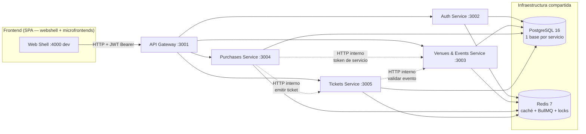
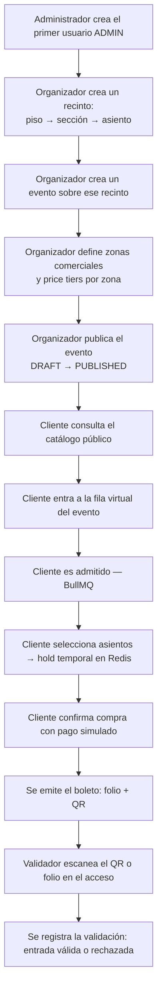
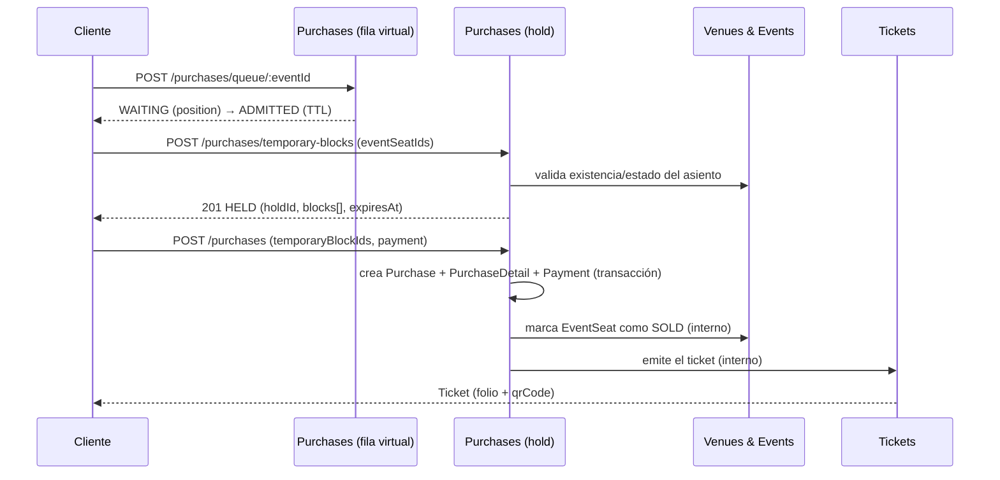

# Arquitectura de Nextticket

> Documentación técnica generada a partir de una revisión directa del código actual (agosto 2026), no de documentación previa. Para el flujo de trabajo con Git, convenciones de commits y proceso de PR, ver el [README.md](../README.md) de la raíz — ese documento sigue siendo la referencia para el proceso de equipo. Este documento se enfoca en **arquitectura y funcionamiento**.

## 1. ¿Qué es Nextticket?

Nextticket es una plataforma de gestión y venta de boletos para eventos. Cubre el ciclo completo del negocio:

```text
Administración de la plataforma
  → configuración de recintos (venues, pisos, secciones, asientos)
  → creación de eventos por un organizador
  → configuración de zonas comerciales y precios
  → publicación del evento
  → un cliente entra a la fila virtual y compra boletos
  → se emiten los boletos (folio + código QR)
  → un validador escanea el boleto en el acceso al evento
```

### Actores principales

| Rol | Qué hace en la plataforma |
|---|---|
| **Administrador** (`ADMIN`) | Gestiona usuarios y roles; tiene acceso a todo lo que puede hacer un Organizador. |
| **Organizador** (`ORGANIZER` / `organizador`) | Crea y administra recintos, eventos, zonas, precios y consulta ventas de sus propios eventos. |
| **Cliente** (`CLIENT` / `usuario`) | Se registra, consulta el catálogo público de eventos, entra a la fila virtual, selecciona asientos, compra y consulta sus boletos. |
| **Validador** (`VALIDATOR` / `validador`) | Escanea/valida boletos (QR o folio) en el acceso a un evento. |

El problema que resuelve la plataforma es doble: dar a organizadores una herramienta para modelar recintos complejos (piso → sección → asiento) y vender por zonas con distintos niveles de precio, y dar a los clientes una compra justa bajo demanda alta, mediante una fila virtual y bloqueos temporales de asiento que evitan la sobreventa durante el checkout.

Además del frontend web, el repositorio incluye una **Alexa Skill** (`apps/alexa-skill`) que consulta la misma API real (consultar eventos, ver ventas por rol, etc. por voz) — es un cliente adicional, no un servicio de negocio nuevo.

---

## 2. Arquitectura general

Nextticket es un **monorepo** con dos grandes áreas, cada una con su propio gestor de paquetes:

- **Frontend** (`apps/frontend/`): **NPM Workspaces**. Un *webshell* (host) más 8 paquetes de "microfrontend" que son código fuente puro (sin build ni dev-server propio) integrados en tiempo de compilación dentro del webshell — no hay Module Federation ni carga remota en runtime.
- **Backend** (`apps/backend/`): 5 microservicios **NestJS** independientes, cada uno con su propio `package.json`/`pnpm-lock.yaml`, su propia base **PostgreSQL 16** (vía **Prisma 7** con `@prisma/adapter-pg`) y compartiendo una misma instancia de **Redis 7**.

Todo el tráfico externo pasa por un **API Gateway** (reverse proxy con `http-proxy-middleware`) que es el único puerto expuesto en producción.



Puntos clave de la arquitectura:

- **API Gateway sin lógica de negocio**: es un proxy transparente (no valida JWT, no reescribe payloads); cada microservicio valida su propio token con el mismo `JWT_SECRET`.
- **Bases de datos aisladas por servicio**: no hay foreign keys entre bases. Las referencias cross-service (`eventId`, `eventSeatId`, `userId`, etc.) son UUIDs opacos. La consistencia entre servicios se resuelve con llamadas HTTP internas protegidas por un `INTERNAL_SERVICE_TOKEN` compartido (p. ej. purchases-service marcando un asiento como vendido en venues-events-service, o pidiéndole a tickets-service que emita el boleto).
- **Redis se usa para tres cosas distintas**: caché de lectura (patrón cache-aside) en los cuatro servicios, colas **BullMQ** para la fila virtual de purchases-service, y locks atómicos (`SET NX EX` + scripts Lua) para los bloqueos temporales de asiento.

---

## 3. Estructura del repositorio

```text
nextticket/
├── apps/
│   ├── frontend/
│   │   ├── commons/                  # Librería compartida (UI, providers, editor de mapas)
│   │   └── apps/
│   │       ├── webshell/             # Host: routing global, layouts, único dev server
│   │       ├── auth-front/           # Login, registro, activación, reset de contraseña
│   │       ├── events-front/         # Catálogo público, detalle, selección de asientos, vista admin de eventos
│   │       ├── organizer-front/      # Panel del organizador
│   │       ├── purchases-front/      # Checkout, fila virtual, historial de compras
│   │       ├── tickets-front/        # Mis boletos (cliente), resumen de ventas (admin)
│   │       ├── users-front/          # CRUD de usuarios (admin)
│   │       ├── validator-front/      # Escaneo/validación de boletos
│   │       └── venues-front/         # CRUD de recintos y editor visual de asientos/zonas
│   ├── backend/
│   │   ├── api-gateway/              # Reverse proxy, único puerto público
│   │   ├── auth-service/             # Usuarios, roles, JWT, OAuth, activación, recuperación
│   │   ├── venues-events-service/    # Recintos, eventos, zonas, precios, asientos
│   │   ├── purchases-service/        # Fila virtual, bloqueo temporal, compra simulada
│   │   └── tickets-service/          # Emisión de boletos, validación, transferencias
│   └── alexa-skill/                  # Cliente adicional: skill de Alexa contra la misma API
├── docker/init-databases.sql         # Crea las 4 bases la primera vez
├── docker-compose.yml                # Infra local: solo Postgres + Redis
├── docker-compose.prod.yml           # Todo en contenedores (lo que corre en la EC2)
├── docs/                             # Esta documentación + guías operativas
└── nextticket.sql                    # Esquema de referencia histórico (ver nota abajo)
```

> **Nota sobre `nextticket.sql`**: es un documento de referencia/diseño heredado, no el esquema real. Algunos elementos que describe (p. ej. un índice único parcial contra doble emisión de ticket por asiento) nunca se portaron a las migraciones reales de Prisma — ver [§10 Estado actual](#10-estado-actual).

### Estructura interna de un microservicio backend

```text
src/
├── <módulo>/              # users/, events/, purchases/, tickets/... — un módulo por dominio
│   ├── *.controller.ts
│   ├── *.service.ts
│   ├── *.module.ts
│   └── dto/                # DTOs del módulo
├── auth/                   # JwtAuthGuard + RolesGuard (archivo equivalente en los 4 servicios)
├── common/                 # PaginationQueryDto / PaginatedResponseDto / pagination.helper.ts
├── health/                 # GET /health
├── prisma/                 # PrismaService (PrismaClient + adapter-pg)
├── redis/                  # RedisService
├── app.module.ts
└── main.ts
```

---

## 4. Frontend

### 4.1 Modelo de integración: workspaces en build-time, no Module Federation

Los 8 paquetes de microfrontend (`auth-front`, `events-front`, `organizer-front`, `purchases-front`, `tickets-front`, `users-front`, `validator-front`, `venues-front`) **no tienen `vite.config.ts` ni dev-server propio**: su `package.json` solo declara `"main": "src/index.ts"` y no expone scripts. Son paquetes de *código fuente* que `webshell` importa directamente como dependencias del workspace de NPM; Vite los compila junto con el resto del bundle del host, igual que `transpilePackages` en Next.js.

El único servidor de desarrollo real es **`webshell`, puerto 4000** (`apps/frontend/apps/webshell/vite.config.ts` — `server: { port: 4000 }`). Por eso el único flujo de desarrollo frontend es `npm run dev` desde `apps/frontend` (delega a `-w @nextticket-frontend/webshell`); no existe un comando para levantar, por ejemplo, solo `events-front` de forma aislada con su propio puerto.

### 4.2 Routing

El ruteo global vive **centralizado en `webshell/src/main.tsx`**, usando `react-router-dom` v7 (re-exportado desde `commons` como el namespace `Router`). Cada módulo de microfrontend exporta componentes de página desde su `src/index.ts`, y webshell los monta en su propio árbol de rutas, envueltos en el layout y el guard de rol que corresponda. Dos excepciones tienen router interno propio: `users-front` y `validator-front`, montados como `path="x/*"` con sus propias sub-rutas.

Tres layouts distintos según la zona de la aplicación:
- `App.tsx` (webshell) — shell de administración (sidebar con Dashboard/Usuarios/Recintos/Eventos), usado por las rutas `admin`.
- `ClientLayout.tsx` (webshell) — header de cliente (Eventos/Mis boletos/Mis compras/carrito), usado por las rutas de compra del cliente.
- `OrganizerLayout` / `ValidatorLayout` — definidos dentro de `organizer-front` / `validator-front` respectivamente.

### 4.3 Autenticación en el frontend

- `SessionProvider` (en `commons`) guarda `{ name, email, role, token, id }` en **`localStorage`** bajo la clave `nextticket:session`. El `token` es el JWT emitido por auth-service.
- `RequireRole` (en `commons`) es el guard de rutas: sin sesión redirige a `/sign-in`; con sesión pero rol no autorizado redirige al *home* del rol actual (mapa `HOME_BY_ROLE`), evitando que un rol entre a la sección de otro.
- Roles que reconoce el frontend: `usuario | organizador | admin | validador` (equivalentes a `CLIENT | ORGANIZER | ADMIN | VALIDATOR` del backend).

### 4.4 Peticiones HTTP

No se usa axios: `commons/src/providers/api.ts` expone el hook `useApi()`, un wrapper delgado sobre `fetch` que agrega automáticamente `Authorization: Bearer <token de la sesión>`, apunta a `API_BASE_URL = import.meta.env.VITE_API_URL ?? "http://localhost:3001"` (el **API Gateway**), y hace logout automático (`signOut()`) si el backend responde `401`. `fetchAuthenticatedBlobUrl()` cubre el caso de recursos binarios protegidos (p. ej. la imagen PNG del QR de un boleto), donde un `` normal no puede llevar el header de autorización.

> En build de producción, `VITE_API_URL` se **incrusta al compilar** (`VITE_API_URL=http://<host>:3001 npm run build`), no se lee en runtime — si la URL del backend cambia hay que recompilar el frontend.

### 4.5 Tema

`ThemeProvider` (en `commons`) mantiene su propio estado (no delega en el hook de tema de HeroUI, para no tener dos fuentes de verdad), persiste la elección en `localStorage` (`heroui-theme`), soporta `light` / `dark` / `system`, y aplica la clase correspondiente al `<html>`. `webshell/src/index.css` declara con Tailwind v4 (config-in-CSS, sin `tailwind.config.js`) tres temas completos como variables CSS: `light`, `dark` y un tema de marca `.nextticket` (acento morado sobre fondo casi negro).

### 4.6 Los microfrontends

| Microfrontend | Responsabilidad | Rol(es) | Rutas principales (montadas desde webshell) |
|---|---|---|---|
| **webshell** | Host: routing global, layouts, providers globales, único dev-server | Orquestador — sirve a todos los roles | `/` y todo el árbol de rutas |
| **auth-front** | Login, registro, activación de cuenta, recuperación/reset de contraseña | Público | `/sign-in`, `/sign-up`, `/activate-account`, `/forgot-password`, `/reset-password` |
| **events-front** | Catálogo público de eventos, detalle, selección de asientos; vista administrativa de eventos | Cliente (catálogo/detalle/asientos) y Admin (`AdminEventsView`) | `/eventos`, `/event/:eventId`, `/event/:eventId/asientos`, `/events/*` (admin) |
| **organizer-front** | Dashboard del organizador, sus eventos, formulario de evento, ventas, editor de zonas | Organizador (y Admin) | `/organizer/dashboard`, `/organizer/myEvents`, `/organizer/salesEvent`, `/organizer/zonas` |
| **purchases-front** | Checkout, confirmación de compra, fila virtual, historial de compras | Cliente | `/event/:eventId/fila`, `/checkout`, `/checkout/confirmacion`, `/mis-compras` |
| **tickets-front** | "Mis boletos" (tarjetas con QR); resumen de ventas por evento | Cliente (boletos) y Admin (resumen de ventas) | `/mis-boletos`, `/tickets/:eventId` (admin) |
| **users-front** | CRUD administrativo de usuarios | Admin | `/users/*` |
| **validator-front** | Escaneo/validación de boletos por QR o folio | Validador (y Admin) | `/validator/*` |
| **venues-front** | CRUD de recintos y editor visual (canvas con `pixi.js`) de pisos/secciones/asientos | Admin | `/venues`, `/venues/canvas`, `/venues/:id/edit`, `/venues/:id/canvas` |

Dependencias cruzadas: `organizer-front` usa componentes de `tickets-front` y `venues-front`; `validator-front` usa `users-front`; todos dependen de `commons`.

---

## 5. Commons

`apps/frontend/commons/` es la librería compartida que consumen los 9 paquetes de frontend. Su `src/index.ts` combina:

- **Re-exports de terceros bajo un único namespace**: todo `@heroui/react` (kit de componentes UI), `lucide-react` como `Icon`, `react-router-dom` como `Router`, `@tanstack/react-table` como `Tanstack` — así ningún microfrontend importa esas librerías por su cuenta, siempre pasan por `commons`.
- **Providers/contexto global**: `ThemeProvider`, `SessionProvider`, `CartProvider`, `RequireRole`, y el cliente HTTP (`useApi`, `ApiError`, `API_BASE_URL`).
- **Componentes propios**: `Panel` (sidebar/drawer), `ProfilePage`, `Carousel`, `ThemeSwitcher`, y una serie de efectos visuales de marca (`Plasma`, `PrismaticBurst`, `RadiantBurst`, `SideRays`, `HeroWaves`, `HeroParticles`, `Logo`).
- **El editor de mapas de recintos**: `PhysicalEditor` y `CommercialEditor` (motor de canvas propio — colisiones, geometría, historial de undo/redo, serialización), usado por `venues-front` (mapa físico del recinto) y por `organizer-front` (`ZonesEditor`, mapa comercial de zonas/precios sobre ese mismo recinto).

Todos los microfrontends deben reutilizar estos componentes en vez de reimplementar UI propia, para mantener la identidad visual homogénea.

---

## 6. Backend

Los cinco servicios comparten patrón: NestJS 11, Prisma 7 (`@prisma/adapter-pg`, obligatorio en Prisma 7), Swagger + Scalar para documentación interactiva, `ValidationPipe` global, CORS restringido a `GATEWAY_URL`, y guard JWT/roles con el mismo `JwtAuthGuard`/`RolesGuard` copiado en los 4 microservicios de negocio (no hay librería compartida de backend — cada servicio es un paquete `pnpm` aislado).

### 6.1 API Gateway

- **Puerto**: `3001`. Único puerto expuesto en producción.
- **Responsabilidad**: reverse proxy transparente (`http-proxy-middleware`), sin lógica de negocio ni validación de token — cada microservicio valida su propio JWT.
- **CORS**: lo centraliza (`origin: '*'`).
- **Documentación**: no genera OpenAPI propio; reenvía `/docs/*`, `/swagger/*` y `/api-json/*` a cada servicio, que es quien expone su propio Scalar/Swagger.
- **Dependencias**: `AUTH_SERVICE_URL`, `VENUES_SERVICE_URL`, `PURCHASES_SERVICE_URL`, `TICKETS_SERVICE_URL`.

| Ruta | Servicio destino |
|---|---|
| `/auth/**`, `/users/**` | Auth Service |
| `/venues/**`, `/events/**`, `/event-categories/**` | Venues & Events Service |
| `/purchases/**` | Purchases Service *(con soporte websocket, `ws: true`)* |
| `/tickets/**` | Tickets Service |
| `/docs/{servicio}`, `/api-json/{servicio}`, `/swagger/{servicio}` | El servicio correspondiente |
| `GET /health`, `GET /` | El propio gateway |

### 6.2 Auth Service

- **Puerto**: `3002` · **BD**: `auth_db`
- **Responsabilidad**: identidad, autenticación, roles.
- **Módulos**: `auth` (registro, login, activación, reset de contraseña, Google OAuth, login por voz para Alexa), `users` (CRUD administrativo), `activation` (tokens de activación vía Redis + correo), `password-reset` (tokens de recuperación vía Redis + correo), `mail` (SMTP con fallback a Ethereal en local).
- **Entidades**: `User` (email único, `password` nullable — nulo mientras está `PENDING` o si es cuenta OAuth, `accountStatus`: `PENDING`/`ACTIVE`, `provider`, `alexaSeed`) y `Role` (relación 1-N con `User`).
- **JWT**: firmado a mano (no Passport) con `jsonwebtoken`, payload `{ email, role }` + `subject: user.id`, algoritmo HS256. El mismo `JwtAuthGuard` se copia en los otros 3 servicios porque todos comparten `JWT_SECRET`.
- **Dependencias**: ninguna hacia otros servicios (es la fuente de identidad).

### 6.3 Venues & Events Service

- **Puerto**: `3003` · **BD**: `venues_events_db`
- **Responsabilidad**: modelo de recintos y el catálogo/ciclo de vida de eventos.
- **Módulos**: `venues` (recintos, pisos, secciones, asientos, elementos de canvas), `events` (CRUD, cambio de estado, estadísticas, imagen del evento), `event-zones` (zonas comerciales de venta y sus price tiers), `event-sections`, `event-seat` (incluye el endpoint interno `POST internal/mark-sold`), `event-categories`.
- **Entidades clave**: `Venue → Floor → Section → Seat` (jerarquía física) más `CanvasElement` (elementos decorativos del mapa); `Event` (pertenece a un `Venue`, `organizerId` opaco); `EventZone` (zona comercial de venta, con precio y capacidad); `EventZoneSection` (liga una zona con una sección física); `EventSeat` (referencia a un `Seat` físico dentro de una zona/evento, con `status` y `lockedUntil`); `EventCategoryAssignment` (N-N Event↔Categoría).
- **Dependencias**: ninguna saliente hacia otros servicios de negocio; recibe llamadas internas de purchases-service (marcar asiento vendido) y de tickets-service (validar pertenencia del asiento a un evento).

### 6.4 Purchases Service

- **Puerto**: `3004` · **BD**: `purchases_db`
- **Responsabilidad**: fila virtual, bloqueo temporal de asientos y la compra (pago simulado).
- **Módulos**: `purchases` (compras, bloqueos temporales), `event-queue` (fila virtual con BullMQ).
- **Entidades**: `Purchase` (folio secuencial `BigInt`, subtotales/impuestos/total, `status`), `PurchaseDetail` (línea de compra por asiento/zona, único por `purchaseId + eventSeatId`), `Payment` (pasarela simulada), `TemporaryBlock` (hold con TTL, `holdGroupId` agrupa un hold multi-asiento), `QueueEntry` (registro de auditoría de la fila; Redis+BullMQ es la fuente de verdad en runtime).
- **Dependencias salientes**: `venues-events-service` (validar asientos, marcarlos vendidos), `tickets-service` (emitir el boleto al confirmar la compra).
- Ver [§9](#9-redis-y-fila-virtual) para el detalle de la fila virtual y los locks.

### 6.5 Tickets Service

- **Puerto**: `3005` · **BD**: `tickets_db`
- **Responsabilidad**: emisión, validación y transferencia de boletos.
- **Módulos**: `tickets` (emisión — incluye el endpoint interno `POST /tickets/internal/issue-for-purchase` llamado por purchases-service —, consulta por hash de QR, generación de imagen QR), `ticket-validations` (registro de cada intento de escaneo en el acceso), `ticket-transfers` (transferencia peer-to-peer entre usuarios).
- **Entidades**: `Ticket` (folio único, `qrCode` = hash SHA-256 único — la imagen se genera al vuelo y nunca se persiste —, `originType`: `PURCHASE`/`COMPLIMENTARY`/`STAFF`/`TRANSFER`, `status`), `TicketValidation` (un registro por escaneo, `result` éxito/rechazo), `TicketTransfer` (`PENDING → COMPLETED`, al completarse cancela el ticket original y emite uno nuevo con `originType=TRANSFER`).
- **Dependencias salientes**: `venues-events-service` (confirmar que el asiento/zona pertenece al evento antes de validar).

---

## 7. Base de datos y Prisma

Cada uno de los 4 microservicios de negocio (auth, venues-events, purchases, tickets) tiene su propio esquema Prisma y su propia base PostgreSQL (`auth_db`, `venues_events_db`, `purchases_db`, `tickets_db`), todas alojadas en la **misma instancia** de Postgres 16 en desarrollo (`docker-compose.yml` levanta un solo contenedor; `docker/init-databases.sql` crea las 4 bases la primera vez).

- **Prisma 7** con `@prisma/adapter-pg`: obligatorio pasar el *driver adapter* al construir `PrismaClient` (no basta con `url` en el datasource) — ver `src/prisma/prisma.service.ts` en cualquier servicio como referencia.
- **Sin foreign keys entre servicios**: toda referencia cross-service (`userId`, `eventId`, `eventSeatId`, `eventZoneId`, `purchaseId`, etc.) es un UUID opaco sin `@relation`. La integridad se resuelve por consistencia eventual vía llamadas HTTP internas, no por el motor de base de datos.
- **Migraciones**: `pnpm exec prisma migrate dev` en desarrollo, `migrate deploy` en servidores sin TTY (CI/EC2). Cambiar `schema.prisma` obliga a que todo el equipo corra la migración nueva — ver convención en el README raíz.
- **Seeds**: `auth-service` siembra los 4 roles (`CLIENT`, `ORGANIZER`, `VALIDATOR`, `ADMIN`) y el primer usuario `ADMIN` (`SEED_ADMIN_EMAIL`/`SEED_ADMIN_PASSWORD`) automáticamente en cada arranque si no existen. `venues-events-service` incluye un seed de datos de demostración (`src/seed/seed-dev-data.ts`, invocado a mano, no automático) que crea eventos publicados de ejemplo a nombre de `organizador@test.com`.

---

## 8. Redis y fila virtual

Redis 7 es compartido por los 4 microservicios de negocio, con tres usos independientes:

1. **Caché de lectura** (patrón cache-aside) en listados frecuentes de los cuatro servicios, e invalidación explícita (`redis.del`) al escribir.
2. **Tokens de un solo uso con TTL**, en auth-service: activación de cuenta, recuperación de contraseña, y el `state` CSRF del flujo de Google OAuth.
3. **Fila virtual y bloqueo temporal de asientos**, en purchases-service — el mecanismo central contra sobreventa durante la compra:

```text
Cliente
  → POST /purchases/queue/:eventId      (se une a la fila; idempotente vía idempotencyKey)
  → GET  /purchases/queue/:eventId/me   (polling: WAITING con `position` → ADMITTED con TTL)
  → [admitido] POST /purchases/temporary-blocks  (bloquea uno o varios asientos, atómico)
  → [hold vigente] POST /purchases       (confirma la compra con un método de pago simulado)
```

- **Fila virtual (BullMQ)**: una `Queue` + `Worker` de BullMQ **por evento**, creados de forma perezosa al primer `join` y registrados en `EventQueueRegistryService`; concurrencia del worker fijada en `1` para serializar las decisiones de admisión sin necesitar un contador atómico aparte. La admisión respeta `MAX_CONCURRENT_ADMITTED_PER_EVENT`; sin cupo, el job se reintenta con backpressure (`job.moveToDelayed()`), no con un cron de reintento. `QueueEntry` en Postgres es solo el registro de auditoría — la fuente de verdad en runtime es Redis/BullMQ.
- **Bloqueo temporal (`TemporaryBlock`)**: TTL configurable (`SEAT_HOLD_TTL_SECONDS`, 8 minutos por defecto). El hold de varios asientos a la vez es **atómico** (script Lua `SET NX EX` sobre todas las claves `event-zone:{zoneId}:seat:{seatId}` en un solo `EVAL`): si cualquier asiento ya está tomado, no se bloquea ninguno (`409`). Un cron cada 30 s marca en Postgres como `EXPIRED` los holds cuya llave de Redis ya venció.
- **Admisión como precondición del hold**: `POST /purchases/temporary-blocks` exige una admisión `ACTIVE` vigente en la fila virtual (clave Redis `admission:event:{eventId}:user:{userId}`); sin ella responde `403`.
- **Estas dos mecánicas usan Redis por separado a propósito**: BullMQ (prefijo `vqueue`) para el FIFO de admisión, y los locks `SET NX EX` para el hold de asientos — mismo Redis, mecanismos independientes.

---

## 9. Flujo funcional completo



---

## 10. Flujo de autenticación

- **Registro de Cliente**: `POST /auth/register` crea la cuenta en estado `PENDING` (sin contraseña) y envía un correo de activación con un token de un solo uso (Redis, TTL configurable, por defecto 48 h). El mismo mecanismo de activación se reutiliza cuando un `ADMIN` da de alta a un Organizador o Validador.
- **Activación**: al usar el enlace, la cuenta pasa a `ACTIVE` y se envía un correo de bienvenida.
- **Login**: `POST /auth/login` con email + contraseña, devuelve `{ token, user }`. El mensaje de error es idéntico para "contraseña incorrecta" y "correo no existe" (evita enumerar correos registrados).
- **Recuperación de contraseña**: mismo patrón de token de un solo uso vía Redis (TTL configurable, por defecto 60 min); las respuestas son siempre genéricas, sin revelar si el correo existe.
- **Google OAuth**: implementado a mano (sin `passport-google-oauth20`). `GET /auth/google` redirige a Google con un `state` CSRF de un solo uso en Redis (10 min); `GET /auth/google/callback` intercambia el código, exige correo verificado, y activa la cuenta automáticamente. Sin credenciales configuradas, el login normal sigue funcionando igual — solo el botón de Google queda deshabilitado (`400 Google OAuth is not configured`).
- **JWT**: firmado con `jsonwebtoken` (HS256), payload `{ email, role }` + `subject: user.id`, expira según `JWT_EXPIRES_IN` (por defecto `1d`). El mismo `JWT_SECRET` debe coincidir en los 4 microservicios de negocio — si no coincide, cualquier microservicio distinto de auth-service rechaza el token con `401` aunque el login haya funcionado.
- **Roles**: se siembran solos al arrancar auth-service (`CLIENT`, `ORGANIZER`, `VALIDATOR`, `ADMIN`). El primer `ADMIN` se crea automáticamente en el primer arranque (`SEED_ADMIN_EMAIL`/`SEED_ADMIN_PASSWORD`); de ahí en adelante los roles se reparten con `PATCH /users/:id/role`.

---

## 11. Flujo de compra



La pasarela de pago es **100% simulada**: cualquier tarjeta se aprueba salvo prefijos reservados para forzar rechazo (`400000…` = declinada, `510510…` = fondos insuficientes); con `paymentMethod: CASH` no se piden datos de tarjeta. Nunca se guardan número de tarjeta ni CVV. El `folio` de la compra es secuencial (`BigInt`).

---

## 12. Tickets

- Un `Ticket` se emite con un `folio` único y un `qrCode` que es un **hash SHA-256** — la imagen QR se genera al vuelo (`GET /tickets/:id/qr`) y nunca se persiste como imagen.
- `originType` distingue cómo se originó el boleto: `PURCHASE` (compra normal), `COMPLIMENTARY`/`STAFF` (cortesía/staff, sin compra asociada), `TRANSFER` (resultado de una transferencia).
- **Estados** (`TicketStatus`): `ISSUED → USED | CANCELED | EXPIRED`.
- **Validación**: `POST /tickets/validations` registra cada intento de escaneo (`TicketValidation`), con `result` de éxito/rechazo y motivo de rechazo si aplica. La regla de negocio es que solo puede existir una validación exitosa por boleto.
- **Transferencia**: un `TicketTransfer` pasa de `PENDING` a `COMPLETED` (o `REJECTED`/`CANCELED`); al completarse, el ticket original se cancela y se emite uno nuevo con `originType=TRANSFER` y un QR distinto.

---

## 13. Recintos

Modelo jerárquico confirmado en `venues-events-service`:

```text
Venue (recinto)
  → Floor (piso)
    → Section (sección física)
      → Seat (asiento físico)
    → CanvasElement (elementos decorativos del mapa: escenario, entradas, baños…)
```

Al crear un evento sobre un `Venue`, el organizador define **zonas comerciales** (`EventZone`) que agrupan una o más `Section` físicas (`EventZoneSection`) y les asigna un precio (`eventPrice`) y, opcionalmente, niveles de precio escalonados (`EventZonePriceTier`: preventa/general/última hora, cada uno con su propia capacidad y ventana de vigencia). Cada asiento físico se expone para ese evento como un `EventSeat`, con su propio `status` (`AVAILABLE`/`RESERVED`/`SOLD`/`DISABLED`) — el `Seat` físico del recinto no cambia de estado entre eventos, solo su `EventSeat` correspondiente.

---

## 14. Eventos

- **Ciclo de vida** (`EventStatus`): `DRAFT → PUBLISHED → CANCELED | SOLD_OUT | COMPLETED`.
- Un evento nace en `DRAFT`, asociado a un `Venue` y a un `organizerId`. Solo se publica (`PATCH /events/:id/status`) cuando tiene zonas y precios configurados.
- Puede tener una o varias categorías (`EventCategoryAssignment`, N-N con `EventCategory`).
- La disponibilidad para compra depende del estado `PUBLISHED` del evento y del estado `AVAILABLE` de cada `EventSeat`/capacidad de zona.

---

## 15. Roles — funcionalidades por rol

### Administrador
Dashboard, gestión de usuarios (`users-front` / `GET`, `PATCH /users/:id/role`, `DELETE`), y todo lo disponible para el Organizador.

### Organizador
Dashboard propio, gestión de sus recintos y eventos (crear, publicar, cancelar), configuración de zonas/precios (editor visual en `organizer-front` + `commons`/`CommercialEditor`), consulta de ventas por evento.

### Cliente
Registro/activación de cuenta, catálogo público de eventos, entrada a la fila virtual, selección de asientos con hold temporal, compra (pago simulado), consulta de "mis compras" y "mis boletos" (con QR), y transferencia de boletos a otro usuario.

### Validador
Consulta de eventos, selección del evento a validar, y validación de boletos por folio o por escaneo de QR (`validator-front`, usa `qr-scanner`), con historial de validaciones.

---

## 16. Convenciones del proyecto

El detalle completo de convenciones de código, Git Flow y proceso de PR vive en el [README.md](../README.md) raíz. Resumen relevante para arquitectura:

- Código (clases, archivos, variables) en **inglés**; mensajes al usuario y documentación de repositorio en **español**.
- Archivos en `kebab-case`, clases en `PascalCase`; DTOs siempre dentro de la carpeta `dto/` del módulo que los usa.
- Todo controlador debe llevar decoradores de Swagger (`@ApiTags`, `@ApiOperation`); todo listado debe estar paginado con el contrato compartido `PaginationQueryDto` / `PaginatedResponseDto` / `pagination.helper.ts` (copiado igual en los 4 servicios).
- Acceso a datos exclusivamente vía `PrismaService` inyectado en la capa `Service`, nunca en el `Controller`.
- Gestores de paquetes: **npm workspaces** para el frontend, **pnpm** (paquete independiente) para cada microservicio backend.

---

## 17. Ejecución local

### Requisitos
Node 20+ (Node 22 recomendado para el backend), pnpm 11+, npm 10+, Docker Desktop.

### Infraestructura
```bash
docker compose up -d
```
Levanta Postgres 16 (con las 4 bases: `auth_db`, `venues_events_db`, `purchases_db`, `tickets_db`) y Redis 7.

### Backend — un `.env` por servicio
```bash
for s in api-gateway auth-service venues-events-service purchases-service tickets-service; do
  cp apps/backend/$s/.env.example apps/backend/$s/.env
done
```
`JWT_SECRET` debe ser **idéntico** en los 4 servicios de negocio (el gateway no valida tokens, así que no necesita `JWT_SECRET` para eso — solo lo usa si se agrega alguna vez lógica propia). Luego, una terminal por servicio:

```bash
cd apps/backend/api-gateway            && pnpm start:dev   # :3001
cd apps/backend/auth-service           && pnpm exec prisma migrate dev && pnpm start:dev   # :3002
cd apps/backend/venues-events-service  && pnpm exec prisma migrate dev && pnpm start:dev   # :3003
cd apps/backend/purchases-service      && pnpm exec prisma migrate dev && pnpm start:dev   # :3004
cd apps/backend/tickets-service        && pnpm exec prisma migrate dev && pnpm start:dev   # :3005
```
Usa siempre `pnpm exec prisma ...`, nunca `npx prisma ...` (evita conflictos entre gestores de paquetes).

Usuarios de prueba (requiere auth-service arriba):
```bash
bash scripts/seed-users.sh
```

### Frontend
```bash
cd apps/frontend
npm install
npm run dev     # levanta webshell en :4000 — es el único dev-server del frontend
```

---

## 18. Puertos

| Componente | Puerto | Notas |
|---|---:|---|
| API Gateway | 3001 | Único puerto expuesto en producción |
| Auth Service | 3002 | |
| Venues & Events Service | 3003 | |
| Purchases Service | 3004 | |
| Tickets Service | 3005 | |
| Webshell (frontend, dev) | 4000 | En producción se sirve como sitio estático (S3), sin puerto propio |
| PostgreSQL | 5432 | Una instancia, 4 bases |
| Redis | 6379 | Compartido por los 4 servicios de negocio |

---

## 19. Variables de entorno

Cada servicio tiene su propio `.env.example`; no se documentan valores reales aquí.

```env
# Comunes a los 4 microservicios de negocio
DATABASE_URL=
REDIS_URL=
PORT=
GATEWAY_URL=
JWT_SECRET=

# Solo auth-service
JWT_EXPIRES_IN=
SEED_ADMIN_EMAIL=
SEED_ADMIN_PASSWORD=
FRONTEND_URL=
GOOGLE_CLIENT_ID=
GOOGLE_CLIENT_SECRET=
GOOGLE_CALLBACK_URL=
ACTIVATION_TOKEN_TTL_HOURS=
PASSWORD_RESET_TOKEN_TTL_MINUTES=
SMTP_HOST=
SMTP_PORT=
SMTP_USER=
SMTP_PASS=
MAIL_FROM=

# Solo venues-events-service / purchases-service / tickets-service (llamadas internas entre servicios)
INTERNAL_SERVICE_TOKEN=
VENUES_EVENTS_URL=
TICKETS_SERVICE_URL=

# Solo purchases-service (fila virtual y holds)
QUEUE_ADMISSION_TTL_SECONDS=
MAX_CONCURRENT_ADMITTED_PER_EVENT=
QUEUE_ADMISSION_RETRY_DELAY_MS=
SEAT_HOLD_TTL_SECONDS=

# Solo tickets-service
QR_HASH_SECRET=

# Solo api-gateway
AUTH_SERVICE_URL=
VENUES_SERVICE_URL=
PURCHASES_SERVICE_URL=
TICKETS_SERVICE_URL=

# Solo frontend (build-time)
VITE_API_URL=
```

---

## 20. Pruebas

```bash
pnpm test        # unitarias, con mocks de Prisma/Redis — no requieren Docker
pnpm test:e2e     # donde exista
```
Se ejecuta dentro de cada microservicio backend (`apps/backend/<servicio>`). `purchases-service` es el único con specs de integración que sí requieren Postgres/Redis/BullMQ reales (`src/{event-queue,purchases,redis}/*.spec.ts`), documentadas en su propio [`TESTING.md`](../apps/backend/purchases-service/TESTING.md), porque las pruebas de concurrencia/atomicidad no se pueden demostrar con mocks. El frontend no tiene un runner de tests configurado a nivel de repositorio.

---

## 21. Estado actual

### Implementado
- Los 5 microservicios backend y los 9 paquetes de frontend descritos arriba, con el flujo completo: recinto → evento → zonas/precios → publicación → catálogo → fila virtual → hold → compra simulada → emisión de ticket → validación.
- Autenticación completa: registro con activación por correo, login, Google OAuth, recuperación de contraseña, roles con guard.
- Fila virtual con BullMQ (una cola por evento) y bloqueo temporal atómico multi-asiento vía Redis.
- Transferencia de boletos entre usuarios.
- Endpoints internos de servicio a servicio (`INTERNAL_SERVICE_TOKEN`) para marcar un asiento como vendido y para emitir el ticket al confirmar una compra.
- Alexa Skill funcional contra la API real, con control por rol.

### Pendientes conocidos
- **Índice único parcial contra doble emisión de ticket por asiento**: `nextticket.sql` documenta `tickets(event_seat_id) WHERE status='ISSUED'`, pero ese índice específico **no existe** en las migraciones reales de `tickets-service` (verificado directamente en `prisma/migrations/`). Sí existe una protección relacionada más nueva — `Ticket_purchaseDetailId_key` (único, migración `20260814100000_add_purchase_detail_unique`) — que impide emitir dos tickets para el mismo `PurchaseDetail`. Esto cubre el camino normal de compra (purchases-service ya exige `(purchaseId, eventSeatId)` único), pero no es exactamente la misma garantía a nivel de `eventSeatId` que describe `nextticket.sql`; vale la pena decidir si sigue haciendo falta.
- El módulo de `promoCodeUsageId` en `PurchaseDetail` existe como campo opaco en el esquema pero no tiene un módulo de códigos promocionales implementado detrás.
- No hay endpoint de logout ni revocación explícita de JWT (el token simplemente expira por `JWT_EXPIRES_IN`).
- No existe un runner de tests de frontend a nivel de repositorio.

> Estos pendientes se documentan tal como se encontraron en el código y en `apps/backend/purchases-service/TESTING.md`; no se implementaron ni modificaron como parte de esta tarea de documentación.
